Il signor Angelo Aprile mi ha portato a casa un vecchio masterizzatore Philips
SPD6002BM. Il dispositivo era ancora integro, ma non avevamo più ciò che serviva
per collegarlo a un computer moderno: un alimentatore compatibile e un
controller per la vecchia interfaccia IDE.

Per riprodurre l'uscita audio analogica utilizzeremo una soundbar amplificata che
possediamo già. La soundbar richiede un'alimentazione a 5 V DC, normalmente
fornita tramite USB. In seguito valuteremo se alimentarla direttamente dalla
linea +5 V del connettore Molex.

Il nostro obiettivo è quindi comprendere come funziona il dispositivo,
identificare le sue connessioni e riportarlo in vita.

## Panoramica del dispositivo

Il Philips SPD6002BM è un masterizzatore interno da 5,25 pollici dotato di
interfaccia IDE/ATAPI. Può leggere e scrivere CD e DVD, compresi DVD a doppio
strato e DVD-RAM.

Supporta inoltre LightScribe, una tecnologia che permetteva di incidere
un'etichetta sul lato superiore di dischi compatibili utilizzando lo stesso
laser impiegato per la masterizzazione.

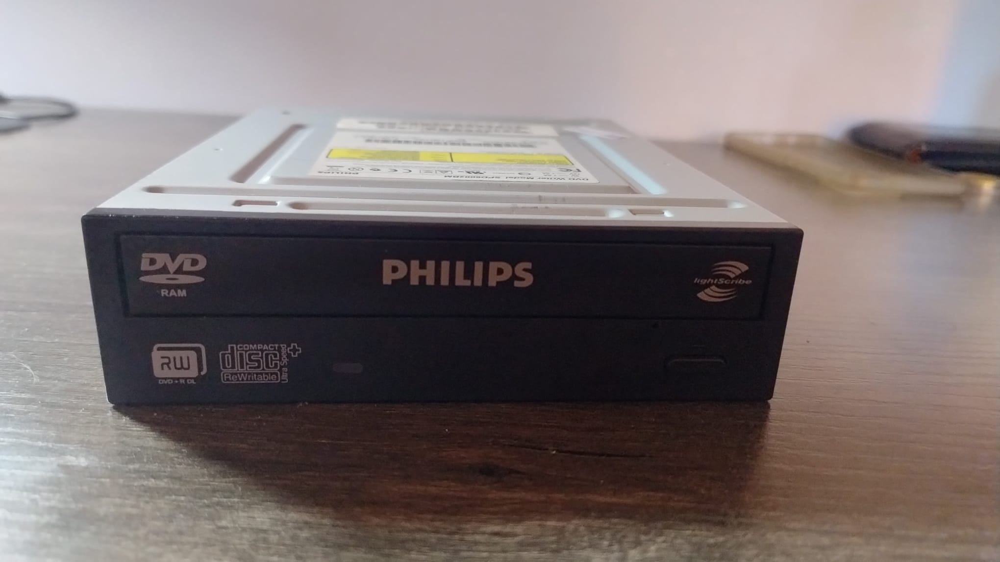

La comunicazione avviene attraverso IDE/ATAPI: IDE, oggi chiamato più
precisamente Parallel ATA o PATA, definisce il collegamento elettrico e il
trasferimento parallelo dei dati; ATAPI permette di inviare al drive i comandi
specifici per i dispositivi ottici.

[Specifiche ufficiali Philips SPD6002BM](https://www.documents.philips.com/assets/20231205/dbab2adf3a5649b1b76ab0cf00a49456.pdf)

## Analisi del pannello posteriore

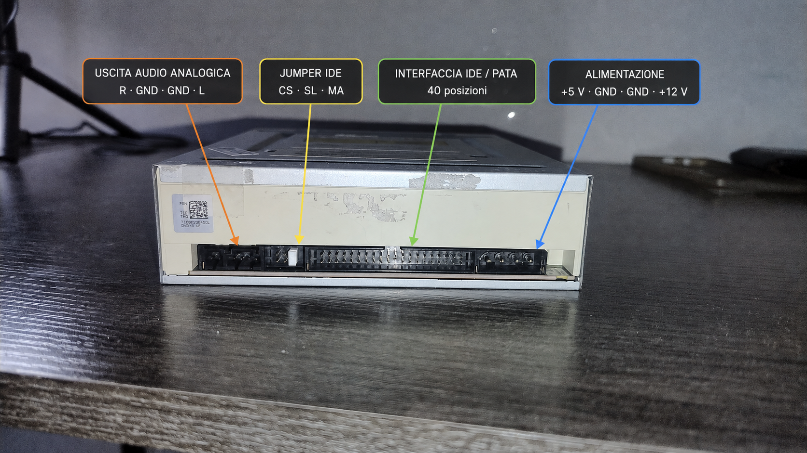

Guardando il drive da dietro, come nella fotografia, i connettori sono disposti
da sinistra verso destra nel seguente ordine:

```text
[AUDIO R G G L] [CS | SL | MA] [IDE/ATAPI] [POWER +5 | G | G | +12]
```

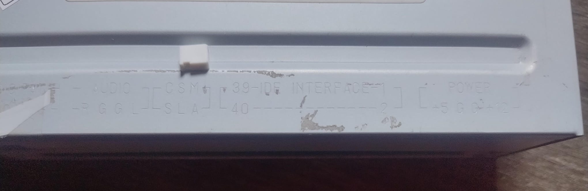

### Audio analogico — `R G G L`

È un'uscita audio analogica stereo a livello linea, disponibile su un connettore
a quattro pin:

- `R`: canale destro, *Right*, normalmente rosso;
- `G`: ground;
- `G`: ground;
- `L`: canale sinistro, *Left*, normalmente bianco.

Nei vecchi computer questo connettore veniva collegato all'ingresso CD di una
scheda audio. I due ground costituiscono il riferimento elettrico dei due segnali
audio e aiutano a ridurre interferenze e diafonia.

Non è un'uscita sufficientemente potente per pilotare direttamente casse
passive: richiede una scheda audio, un amplificatore oppure casse amplificate.
Nei sistemi più recenti l'audio del CD viene normalmente letto in forma digitale
attraverso l'interfaccia IDE, quindi questo cavo non è più indispensabile.

### Jumper — `CS`, `SL`, `MA`

Il piccolo cappuccio bianco è un jumper: contiene un contatto metallico che
mette elettricamente in comunicazione due pin.

Le tre posizioni sono:

- `CS`, Cable Select: il ruolo del drive viene determinato dalla sua posizione
  sul cavo IDE;
- `SL`, Slave: configura il drive come secondo dispositivo del canale;
- `MA`, Master: configura il drive come dispositivo principale.

Con un solo dispositivo, la configurazione Master è generalmente quella
richiesta dal controller utilizzato in questo progetto.

### Interfaccia IDE/ATAPI

Il grande connettore centrale è un header IDE/PATA a 40 posizioni, organizzate
in due file.

I suoi pin trasportano:

- 16 linee dati parallele;
- segnali di indirizzamento;
- comandi di lettura e scrittura;
- interrupt;
- richieste DMA;
- reset;
- Cable Select;
- diversi collegamenti di ground.

Questa interfaccia non alimenta il drive: dati e alimentazione viaggiano
attraverso due connettori separati.

### Alimentazione — `+5 G G +12`

Il connettore di alimentazione è il classico connettore periferico a quattro
contatti, spesso chiamato informalmente “Molex”.

Guardandolo dal retro del drive, come nella fotografia, troviamo:

| Posizione | Tensione | Colore del cavo |
| --- | --- | --- |
| Vicino all'IDE | +5 V | Rosso |
| Centrale | GND | Nero |
| Centrale | GND | Nero |
| Lato esterno | +12 V | Giallo |

Il masterizzatore utilizza due tensioni perché al suo interno convivono
componenti con esigenze differenti. I 5 V alimentano principalmente la logica
digitale e i circuiti di controllo; i 12 V vengono usati soprattutto dai motori
che ruotano il disco, spostano il gruppo ottico e aprono il vassoio.

La tensione deve essere interpretata rispetto al ground:

```text
+5 V  → circuiti elettronici → GND → alimentatore
+12 V → motori e meccanica   → GND → alimentatore
```

I due contatti di ground non rappresentano due masse separate. Sono normalmente
collegati allo stesso nodo a 0 V e costituiscono il percorso attraverso cui la
corrente ritorna all'alimentatore. Due conduttori riducono la resistenza, la
caduta di tensione e il riscaldamento, oltre ad aiutare a gestire i disturbi
prodotti dai motori.

> **Nota:** il ground di alimentazione non deve essere confuso automaticamente
> con la terra di protezione dell'impianto elettrico: in questo circuito è
> innanzitutto il riferimento comune e il ritorno della corrente continua.

## Cosa serve per riattivarlo?

1. Un alimentatore regolato che fornisca contemporaneamente +5 V e +12 V.
2. Un controller standalone compatibile con drive IDE/ATAPI.
3. Un cavo IDE/PATA a 40 pin.
4. Un cavo per prelevare l'uscita audio analogica.
5. Una soundbar attiva oppure un amplificatore con diffusori.

Non bisogna alimentarlo con un semplice trasformatore da 12 V: la presenza del
connettore Molex non significa che il drive funzioni con i soli 12 V. Non
bisogna inoltre invertire +5 V e +12 V, collegare direttamente tra loro le due
linee o inserire e rimuovere i connettori mentre il dispositivo è alimentato.

## Controller

Per controllare il drive senza utilizzare un computer abbiamo acquistato su
[AliExpress un controller standalone per unità IDE/ATAPI](https://it.aliexpress.com/i/4000549047832.html).

La scheda comprende:

- un connettore IDE/PATA a 40 pin;
- un display LCD 1602;
- alcuni pulsanti per controllare la riproduzione;
- un ricevitore con telecomando;
- un potenziometro, collocato sul retro del display, per regolarne il contrasto;
- un ingresso di alimentazione in corrente continua da 8 a 12 V.

È disponibile anche una versione in kit, fornita come circuito stampato e
componenti da saldare.

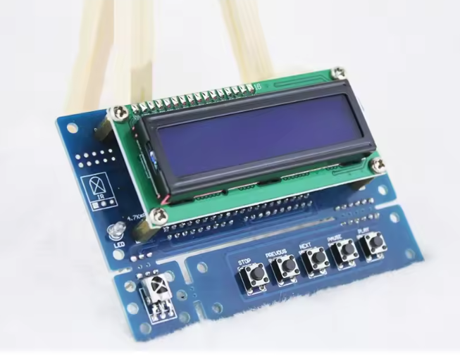

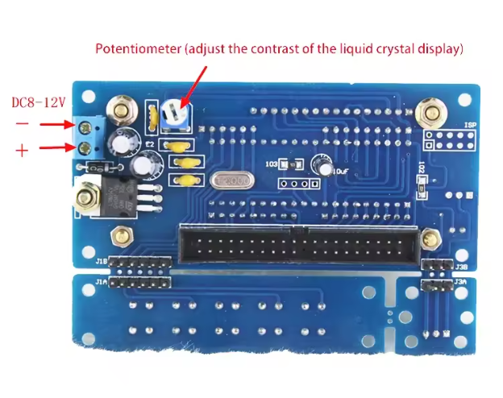

Esiste anche la scheda perforata da saldare: magari un'altra volta. Ecco i
componenti:

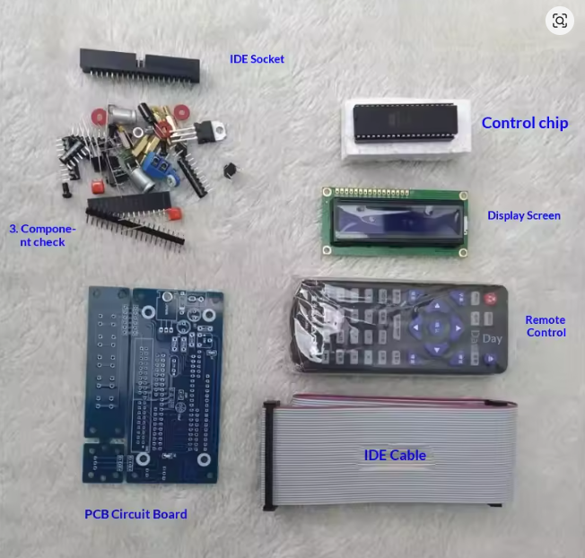

## Configurazione del jumper

Secondo le istruzioni del controller, il drive deve essere configurato come
Master. Spostiamo quindi il jumper sulla posizione `MA` prima di collegare
l'alimentazione.

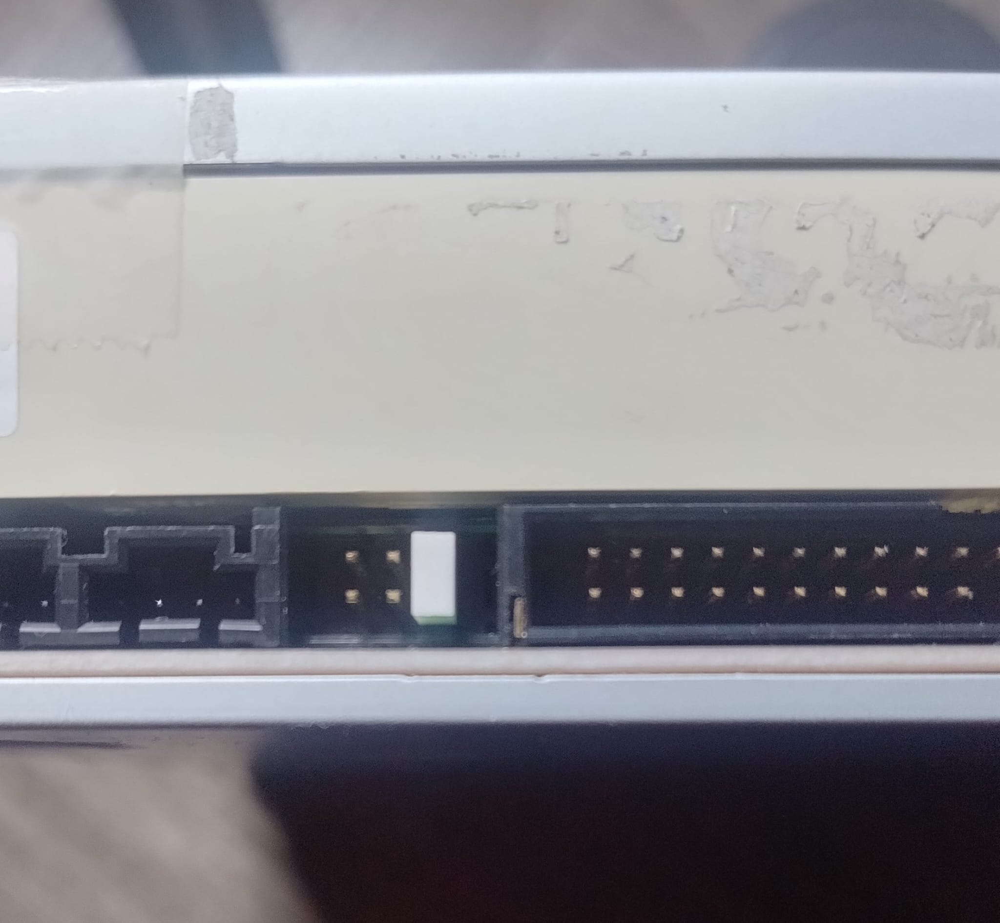

## Soundbar attiva alimentata a 5 V

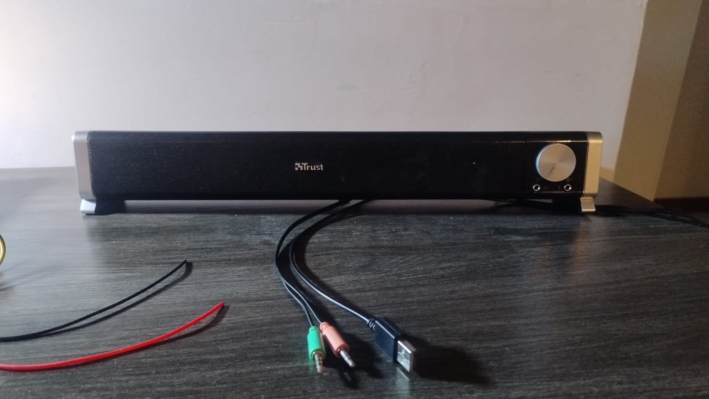

La soundbar contiene un amplificatore e richiede un'alimentazione a 5 V DC,
normalmente fornita tramite USB.

È possibile alimentarla dalla linea +5 V del Molex, collegando il positivo al
filo rosso e il ground a un filo nero. Prima di effettuare qualsiasi saldatura
bisogna verificare tensione e polarità con un multimetro. I fili dati del cavo
USB non devono essere collegati e vanno isolati.

## Collegare l'audio allo speaker

Per collegare l'uscita del drive alla soundbar utilizzeremo un cavo CD-audio con
connettore a quattro pin e un adattatore verso il jack stereo da 3,5 mm.

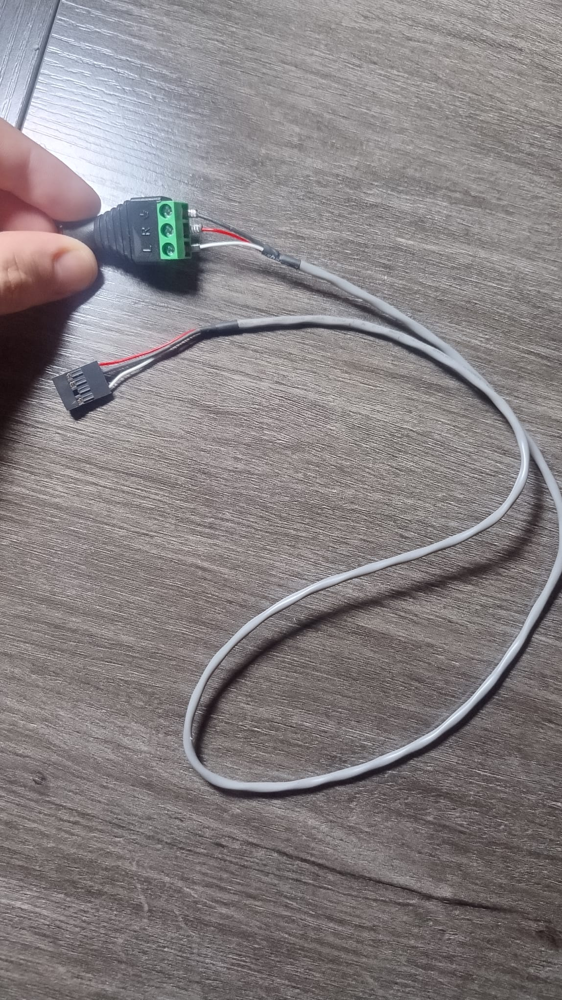

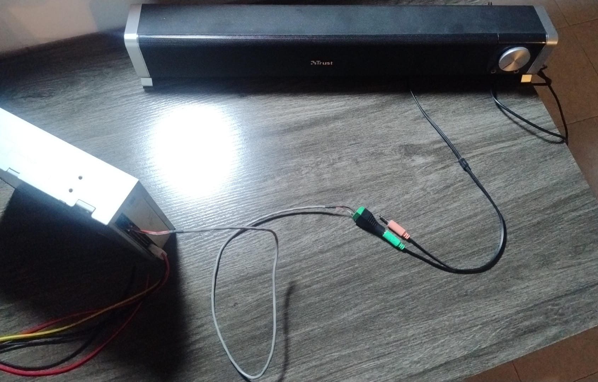

## Alimentazione

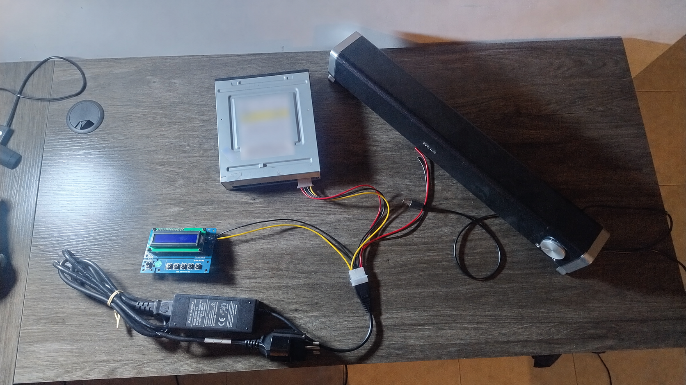

L'alimentatore dispone di due linee separate:

- filo rosso: +5 V;
- fili neri: GND;
- filo giallo: +12 V.

Lo splitter Molex non converte le tensioni: si limita a distribuire le linee
+5 V, GND e +12 V già prodotte dall'alimentatore.

Il drive utilizza entrambe le tensioni. Il controller, compatibile con un
ingresso da 8 a 12 V, può essere alimentato dalla linea gialla da +12 V e da uno
dei fili neri di ground. La soundbar può invece utilizzare la linea rossa da
+5 V.

> **Attenzione:** verificare sempre tensione, polarità e collegamenti prima di
> alimentare il circuito. Invertire +5 V e +12 V può danneggiare i dispositivi.

## Collegamento del cavo IDE

Colleghiamo il drive al controller mediante il cavo IDE/PATA a 40 pin. La
striscia rossa del cavo identifica il pin 1 e, sul masterizzatore, deve trovarsi
dal lato più vicino al connettore Molex.

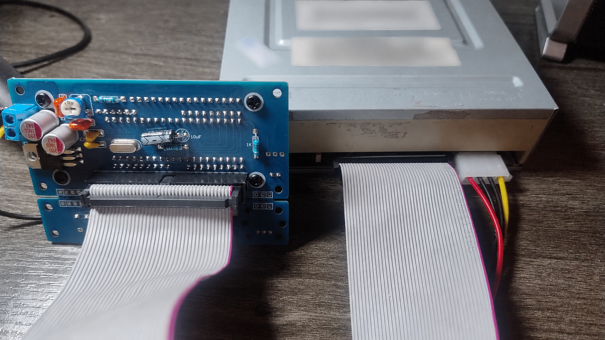

## Il risultato

A questo punto siamo pronti per connettere tutto e goderci i Delta Heavy.

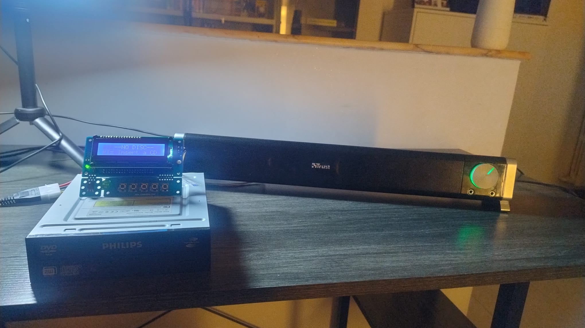

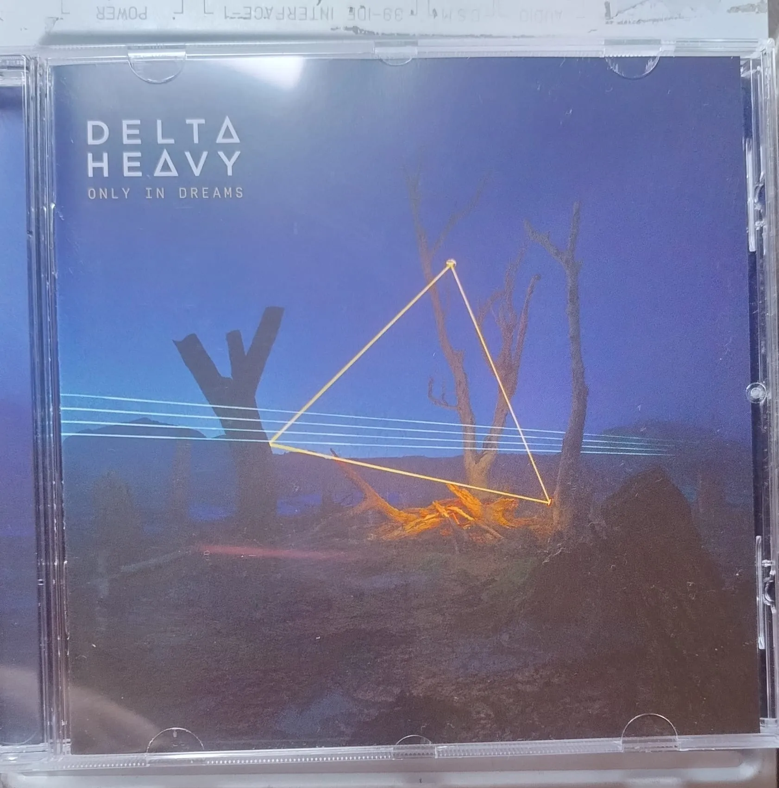
