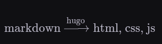
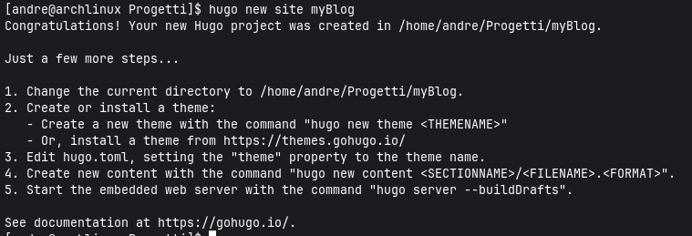
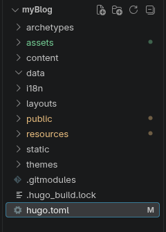

## The problem I wanted to solve

I had wanted to create a blog for a long time, but I did not want to use a
content management system such as WordPress. I also did not want to build every
part of the website from scratch before I could publish a single note.

What I needed was more specific:

1. I wanted to write in Markdown.
2. I wanted the result to be a static website.
3. I wanted a project I could understand one layer at a time.
4. I wanted the content to remain useful even if I changed the theme later.
5. I wanted the site to work as both a chronological diary and a technical
   archive.

That last requirement became the most important one. A normal blog is usually
organized by publication date. My notes are not: networking belongs with
networking, operating-system notes belong with operating systems, and labs
belong with the technology they exercise. I therefore needed chronology and
hierarchy at the same time.

## The idea that started the project

I found Leonardo Tamiano's article
[How I manage my blog](https://blog.leonardotamiano.xyz/tech/how-i-manage-my-blog/).
His publishing pipeline is based on Emacs, Org mode, `ox-hugo`, and Hugo:

```text
Org mode -> ox-hugo -> Markdown -> Hugo -> HTML, CSS, and JavaScript
```

That pipeline made the separation of responsibilities easy to see: the writing
format is not the website, and the website generator is not the editor.

My pipeline starts one step later because I already work comfortably with
Notion and Markdown:



```text
Notion -> Markdown and resources -> review -> Hugo -> static website
```

I do not currently use Emacs, Org mode, or `ox-hugo`. That is not a permanent
rejection of them. The useful part of a layered pipeline is that I can add a new
authoring layer later without changing the content architecture underneath it.

## Why a static website

The site publishes the same documents to every visitor. It does not currently
need accounts, per-user dashboards, comments stored in a database, or dynamic
server-side rendering. For this use case, a static build has useful properties:

- the production output is a directory of files;
- the content can be versioned together with the templates;
- there is no application server or database to maintain for normal page
  delivery;
- the public runtime has fewer moving parts;
- deployment can be reduced to publishing the generated `public/` directory.

Static does not mean automatically secure. The web server, deployment system,
third-party scripts, dependencies, and browser-side code still matter. It does
mean that I am not adding a dynamic backend before I have a requirement for
one. Each unnecessary runtime component would add configuration, updates, and
potential attack surface.

## What Hugo does

Hugo is a static site generator. It reads configuration, content, templates,
and resources, then produces a publishable website. During development it also
provides a local server with automatic rebuilds.

The important boundary is this:

```text
Source of truth                         Generated output
------------------------------------    ----------------
content/                                public/
layouts/            -> Hugo build ->   HTML pages
assets/                                 CSS and JavaScript
static/                                 copied static files
hugo.toml                               page resources
```

I edit the source side. Hugo owns the generated side. A file under `public/`
may help with debugging, but it must not become the only place where a fix is
made because the next build will replace it.

## Creating the project

I use Arch Linux, so I installed Hugo from the system repository and checked
the executable before creating the site:

```bash
sudo pacman -Syu hugo
command -v hugo
hugo version
```

`pacman -Syu` performs a full system upgrade as well as installing the package,
which is the supported update model on Arch. It is more consequential than a
package-only install, so I should review the transaction before confirming it.

The command I originally ran was:

```bash
hugo new site myBlog
```



Current Hugo documentation uses `hugo new project` for this operation. The log
records the command that actually created this repository; a future setup guide
should use the command supported by the Hugo version it targets.

Next, I initialized version control and added the theme:

```bash
cd myBlog
git init
git submodule add \
  https://github.com/hugo-sid/hugo-blog-awesome.git \
  themes/hugo-blog-awesome
```

The theme is a Git submodule, not copied application code. The parent
repository records the theme repository URL in `.gitmodules` and records a
specific theme commit. This makes the version reproducible, but it also means a
fresh clone must initialize submodules:

```bash
git clone --recurse-submodules <repository-url>
```

For an existing clone where the submodule is empty:

```bash
git submodule update --init --recursive
```

## Selecting and configuring the theme

I chose
[Hugo Blog Awesome](https://github.com/hugo-sid/hugo-blog-awesome) because it
already provides a minimal layout, responsive behavior, dark mode, syntax
highlighting, and RSS support. This lets me focus on content organization while
still keeping the theme replaceable.

The current theme documentation requires Hugo Extended v0.160.0 or later. The
Extended edition matters here because the theme and project process SCSS. The
installed build is checked with `hugo version` before blaming content or
templates for a version incompatibility.

The project selects it in `hugo.toml`:

```toml
theme = "hugo-blog-awesome"
```

The first useful configuration establishes identity, language, time zone,
navigation, and theme parameters:

```toml
baseURL = "https://tuo-dominio.it/"
title = "Andrea Romano"
theme = "hugo-blog-awesome"

locale = "it-IT"
defaultContentLanguage = "it"
defaultContentLanguageInSubdir = false
timeZone = "Europe/Rome"
```

`baseURL` is still a placeholder and must be replaced before a real deployment.
Hugo uses it when generating absolute URLs such as canonical links and feed
entries. `locale` controls locale-sensitive formatting, while `timeZone`
ensures dates without an explicit zone are interpreted consistently.

The menu exposes the four site areas:

```toml
[menu]
  [[menu.main]]
    name = "Hello World"
    pageRef = "/"
    weight = 10

  [[menu.main]]
    name = "man"
    pageRef = "/man"
    weight = 20

  [[menu.main]]
    name = "posts"
    pageRef = "/posts"
    weight = 30

  [[menu.main]]
    name = "whoami"
    pageRef = "/whoami"
    weight = 40
```

The weights are unique so the intended order does not depend on how equal items
happen to be resolved. `pageRef` is preferable to a hard-coded URL because it
refers to a Hugo page and can follow changes to its permalink.

## Starting the local server

The normal preview command is:

```bash
hugo server
```

Hugo prints the actual local address, normally `http://localhost:1313/`. Draft
content is excluded by default. To include it:

```bash
hugo server --buildDrafts
```

The short form is `hugo server -D`. If a template change appears stale during
development, a useful diagnostic is:

```bash
hugo server --disableFastRender
```

Disabling fast render is a debugging tool, not a fix for incorrect templates.
It asks Hugo to rebuild more of the site on every change.

## Adding the first content

Hugo can create a page from an archetype:

```bash
hugo new content content/posts/my-first-post.md
```

The generated front matter initially marks the page as a draft:

```toml
+++
title = "My First Post"
date = 2026-08-28T07:22:44+02:00
draft = true
+++
```

The time-zone offset is `+02:00` for Rome during summer time. The original note
used `-02:00`, which would describe a different zone and move the instant by
four hours relative to local time.

Drafts are visible with `hugo server -D` but are not included in a normal
production build. Publishing means either removing `draft` or setting it to
`false`.

## The initial project tree

After Hugo and the theme were in place, the repository looked like this:



The main directories have different ownership:

- `archetypes/` contains templates for new content files;
- `assets/` contains resources processed by Hugo Pipes, such as SCSS and icons;
- `content/` contains Markdown and page resources;
- `layouts/` contains project templates that override or extend the theme;
- `public/` is generated output;
- `resources/` is Hugo's generated resource cache;
- `static/` contains files copied directly to the published site;
- `themes/` contains the theme submodule.

Knowing who owns each directory prevents a common mistake: editing a generated
file because it is the easiest copy to find.

## Small visual changes

The theme highlighted selected text in yellow, which did not fit the palette. I
overrode the selection color in `assets/sass/_custom.scss`:

```scss
::selection {
  color: #ffffff;
  background-color: #2563eb;
}

html.dark ::selection {
  color: #ffffff;
  background-color: #dc2626;
}

@media (prefers-color-scheme: dark) {
  html:not(.light) ::selection {
    color: #ffffff;
    background-color: #dc2626;
  }
}
```

I also wanted mouse clicks not to leave an outline around controls while
preserving visible keyboard focus:

```scss
a:focus:not(:focus-visible),
button:focus:not(:focus-visible) {
  outline: none;
  box-shadow: none;
}
```

The distinction is essential. Removing every focus outline would make keyboard
navigation difficult. `:focus-visible` lets the browser keep a visible focus
indicator when the interaction method needs one.

## The first architecture was not enough

At this point the site could render Markdown, but it still behaved like a
normal flat blog. My real requirement was a manual that behaves like a file
system while retaining a chronological writing history.

That problem produced the next set of changes: nested Hugo sections, branch and
leaf bundles, a directory browser, and a shared timeline. They are separated
into their own logs because each decision deserves its own explanation.
