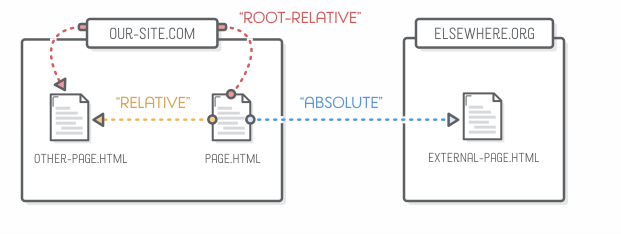
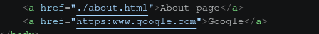
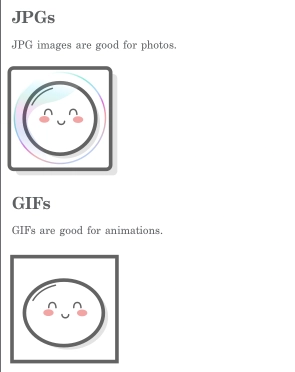
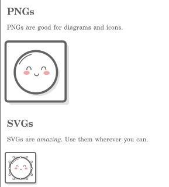

HTML descrive la struttura e il significato del contenuto di una pagina web.
Il documento iniziale di un sito viene normalmente chiamato `index.html`, nome
che i web server cercano come risorsa predefinita di una directory.

Riferimento: [elenco degli elementi HTML su MDN](https://developer.mozilla.org/en-US/docs/Web/HTML/Reference/Elements).

## Boilerplate

In VS Code, l'abbreviazione Emmet `!` genera il boilerplate di base.

- `<!doctype html>` attiva la modalità standard del browser.
- `lang` dichiara la lingua principale e aiuta screen reader, traduttori e
  motori di ricerca.
- `<meta charset="UTF-8">` imposta la codifica e deve comparire all'inizio di
  `<head>`.
- `<meta name="viewport" ...>` permette al layout di adattarsi correttamente
  alla larghezza dei dispositivi mobili.
- `<title>` definisce il titolo mostrato nella scheda e usato nei segnalibri e
  nei risultati dei motori di ricerca.

```html
<!DOCTYPE html>
<html lang="en">
<head>
  <meta charset="UTF-8">
  <meta name="viewport" content="width=device-width, initial-scale=1.0">
  <title>Document</title>
</head>
<body>
  <h1>Hello world!</h1>
</body>
</html>
```

### Commenti

In VS Code, `Ctrl+/` attiva o disattiva il commento sulla selezione. In HTML i
commenti usano `<!-- testo -->` e non vengono mostrati nella pagina.

## Link



Un URL assoluto contiene schema e host; un path relativo viene risolto rispetto
all'URL del documento corrente. Il prefisso `./` rende esplicita la directory
corrente, ma non è obbligatorio.

```html
<!-- Link esterno aperto in una nuova scheda -->
<a href="https://www.theodinproject.com/about"
   target="_blank"
   rel="noopener noreferrer">About The Odin Project</a>

<!-- Link relativo alla directory del documento corrente -->
<a href="./pages/about.html">About</a>
```

Quando si usa `target="_blank"`, `noopener` impedisce alla nuova pagina di
controllare quella di origine tramite `window.opener`; `noreferrer` rimuove
anche l'header HTTP `Referer`. Approfondimento: [sicurezza e privacy del Referer su MDN](https://developer.mozilla.org/en-US/docs/Web/Privacy/Guides/Referer_header:_privacy_and_security_concerns#the_referrer_problem).



## Immagini

- `src` indica la risorsa da caricare.
- `alt` fornisce un'alternativa testuale. Deve descrivere lo scopo
  dell'immagine; per un'immagine puramente decorativa si usa `alt=""`.
- `width` e `height` dichiarano le dimensioni intrinseche e permettono al
  browser di riservare spazio prima del caricamento, riducendo il layout shift.

```html
<!-- Absolute path -->

<!-- Relative path -->

```





Gli attributi HTML `width` e `height` accettano numeri interi espressi in pixel
CSS, quindi non si scrive l'unità:

`` 

- Se si specifica una sola dimensione, il browser mantiene il rapporto
  intrinseco dell'immagine.
- In CSS, invece, una lunghezza diversa da zero richiede normalmente l'unità,
  per esempio `width: 300px`.
- Per schermi ad alta densità non basta raddoppiare sempre i pixel: `srcset` e
  `sizes` permettono al browser di scegliere la risorsa più adatta.
