[Image Color Picker](https://imagecolorpicker.com/) è uno strumento utile per
campionare un colore da un'immagine.

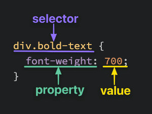

CSS può stilizzare qualsiasi elemento HTML; `<div>` e `<span>` sono contenitori
generici utili quando non esiste un elemento semantico più adatto.

## Selettori

Selettori di base:

```css
/* Universal */
* {
	color: purple;
}

/* type selector */
div {
	color: white;
}

/* Class selector */
.alert_text {
 color: red;
}

/* Elemento che possiede entrambe le classi */
/* HTML -> <div class="alert_text severe_alert"> */
.alert_text.severe_alert {
	color: purple;
}

/* Selettore ID: da usare con moderazione */
#title {
	background-color: red;
}
```

## Proprietà

- `color` imposta il colore del testo.
- `background-color` imposta il colore di sfondo.
- `font-family` accetta una lista ordinata di famiglie. I nomi con spazi vanno
  tra virgolette e la lista dovrebbe terminare con una famiglia generica:
  `font-family: "Times New Roman", serif`.
- `font-size` imposta la dimensione del testo.
- `font-weight` imposta il peso; può usare parole chiave (`normal`, `bold`) o
  valori numerici normalmente compresi tra `1` e `1000`, se supportati dal font.
- `text-align` controlla l'allineamento del contenuto inline.

```css
/* Mantiene le proporzioni intrinseche */
img {
  height: auto;
  width: 500px;
}
```

## Aggiungere CSS

- **Esterno:** `<link rel="stylesheet" href="styles.css">`. È la soluzione
  normale: separa struttura e presentazione e consente al browser di riusare il
  file dalla cache.
- **Interno:** `<style>/* regole CSS */</style>`. È utile per una singola pagina
  o per esempi isolati.
- **Inline:** `<div style="color: white; background-color: black">...</div>`.
  Ha specificità elevata ed è difficile da mantenere; è meglio riservarlo a
  valori generati dinamicamente o a prove temporanee nei DevTools.

## Cascade CSS

La **cascade** decide quale regola CSS viene applicata quando più regole puntano allo stesso elemento.

### Regola pratica

In una versione semplificata, tra dichiarazioni della stessa origine e dello
stesso livello di importanza il browser considera:

1. **specificità** del selettore;
2. **ordine di apparizione**, quando la specificità è uguale.

Origine, `!important` e cascade layers vengono valutati prima della specificità.
L'ereditarietà non è un terzo criterio di spareggio: fornisce un valore solo
quando l'elemento non riceve una dichiarazione applicabile per quella proprietà.

### Specificity

Ordine di forza dei selettori:

```
ID selector       → più forte
Class selector    → medio
Type selector     → più debole
```

Esempio:

```html
<p id="title" class="text">Hello</p>
```

```css
p {
    color: blue;
}

.text {
    color: green;
}

#title {
    color: red;
}
```

Risultato:

```
Il testo sarà rosso.
```

Perché `#title` è più specifico di `.text` e `p`.

### Più selettori = più specificità

```html
<div class="main">
    <div class="list subsection">Red text</div>
</div>
```

```css
.subsection {
    color: blue;
}

.main .list {
    color: red;
}
```

Risultato:

```
Il testo sarà rosso.
```

Perché `.main .list` ha due classi, mentre `.subsection` ne ha una sola.

### Stessa specificità: vince l’ultima regola

```html
<p class="alert warning">Warning message</p>
```

```css
.alert {
    color: red;
}

.warning {
    color: yellow;
}
```

Risultato:

```
Il testo sarà giallo.
```

Perché `.alert` e `.warning` hanno la stessa specificità, ma `.warning` viene scritta dopo.

### Inheritance

Alcune proprietà vengono ereditate dai figli, per esempio `color` e `font-family`.

```html
<div class="container">
    <p>Hello</p>
</div>
```

```css
.container {
    color: blue;
}
```

Risultato:

```
Il paragrafo sarà blu.
```

Perché il `p` eredita `color` dal genitore.

Ma una regola diretta può sovrascrivere l’ereditarietà:

```css
.container {
    color: blue;
}

p {
    color: red;
}
```

Risultato:

```
Il paragrafo sarà rosso.
```

Perché `p` ha una regola diretta.

---

### Classe + classe sullo stesso elemento

Senza spazio:

```css
.subsection.header {
    font-size: 20px;
}
```

Seleziona un elemento che ha entrambe le classi:

```html
<div class="subsection header">Latest Posts</div>
```

---

### Classe dentro un’altra classe

Con spazio:

```css
.subsection .header {
    font-size: 20px;
}
```

Seleziona `.header` solo se si trova dentro `.subsection`:

```html
<div class="subsection">
    <p class="header">Latest Posts</p>
</div>
```

Da ricordare:

```
.subsection.header   → stesso elemento
.subsection .header  → elemento dentro un altro elemento
```

---

### Grouping selectors

La virgola serve per applicare la stessa regola a più selettori.

```html
<div class="subsection header">Latest Posts</div>
<p class="subsection preview">Post preview</p>
<p class="subsection" id="text">With id</p>
```

```css
.subsection.header,
.subsection.preview,
.subsection#text {
    font-size: 20px;
}
```

Significa:

```
Applica font-size: 20px a tutti e tre gli elementi.
```

---

### Consiglio pratico

Preferisci classi semplici:

```css
.card {
    background-color: white;
}

.card-title {
    font-size: 24px;
}

.card-text {
    color: gray;
}
```

Evita selettori troppo annidati:

```css
/*Peggio*/
main section div ul li a span {
    color: red;
}

/* Meglio */
.nav-label {
    color: red;
}
```

### Regole da ricordare

```
ID batte class.
Class batte type.
Più classi battono meno classi.
A parità di specificità, vince la regola scritta dopo.
Le proprietà ereditate sono deboli: una regola diretta le sovrascrive.
Meglio usare classi semplici e mantenere bassa la specificità.
```

Strumenti e approfondimenti:

- [Specificity Calculator](https://specificity.keegan.st/)
- [The CSS Cascade](https://2019.wattenberger.com/blog/css-cascade)

## DevTools

- [Panoramica dei Chrome DevTools](https://developer.chrome.com/docs/devtools/overview?hl=it)
- [Ispezionare e modificare il CSS](https://developer.chrome.com/docs/devtools/css?hl=it)

**DOM vs HTML**

- HTML = codice iniziale scritto nel file.
- DOM = struttura attuale della pagina nel browser.

Esempio:

```html
<!-- HTML iniziale -->
<div id="container"></div>

<!-- Dopo la modifica con JS, nel DOM -->
<div id="container">Hello</div>
```

JavaScript può aggiungere contenuto:

```js
document.querySelector("#container").textContent = "Hello";
```

Il pannello **CSS Overview** aiuta a valutare colori, font, media query e regole
inutilizzate dell'intera pagina.

## Font

Riferimento: [font CSS](https://www.w3schools.com/Css/css_font.asp).

- In `font-family` meglio mettere dei fall-back per non ritrovarsi un sito rotto

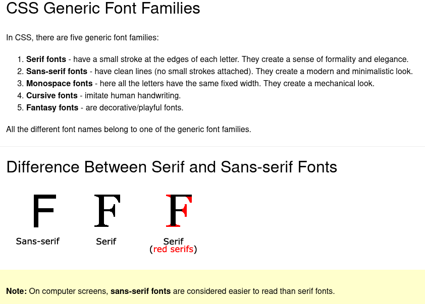

- I font “web safe” sono comunemente presenti sui sistemi operativi, ma non sono
  garantiti su ogni dispositivo.

  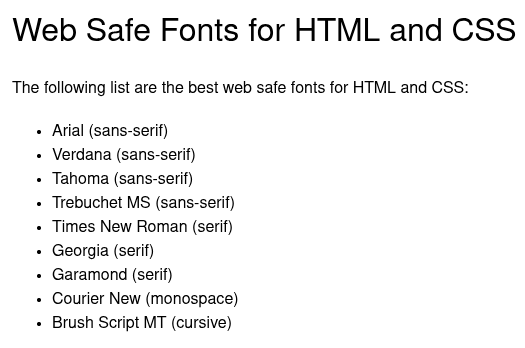

- [Fallback comuni](https://www.w3schools.com/Css/css_font_fallbacks.asp)
- [Usare Google Fonts](https://www.w3schools.com/Css/css_font_google.asp)

## Box model

Nel layout CSS ogni elemento genera uno o più box. Un outline temporaneo aiuta
a visualizzarne i confini:

```css
* {
  outline: 2px solid red;
}
```

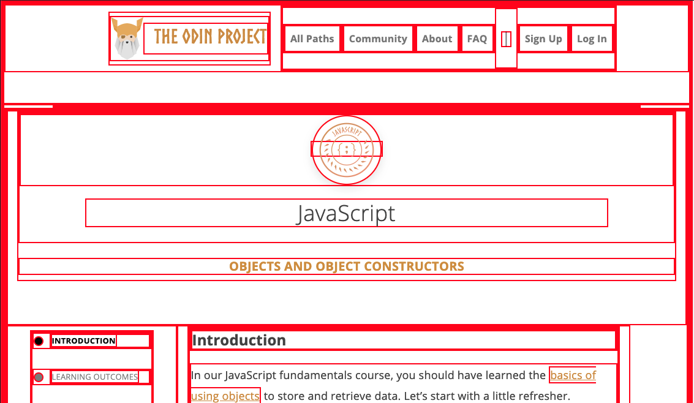

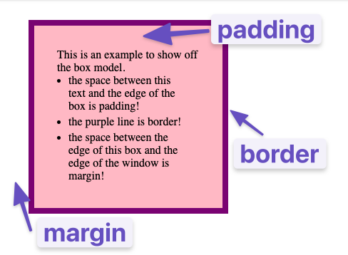

### Dimensioni del box

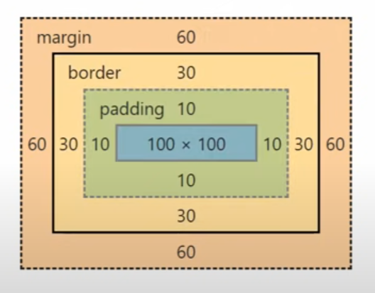

```css
.box {
  width: 100px;
  height: 100px;
  padding: 10px;
  border: 30px solid purple;
  margin: 60px;
  background-color: red;
  text-align: center;
}
```

### Margin collapsing

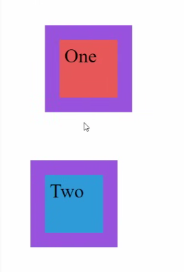

I margini verticali adiacenti di due box block nel normale flusso possono
collassare. Se entrambi sono positivi, la distanza risultante è il maggiore dei
due, non la loro somma: `margin-bottom: 100px` e `margin-top: 70px` producono
una distanza di `100px`. Il collapsing non si applica allo stesso modo nei
layout Flexbox e Grid.

### `box-sizing`

```css
.box {
  width: 100px;
  height: 100px;
  padding: 10px;
  border: 20px solid purple;
  margin: 60px;
  background-color: red;
  box-sizing: border-box;
}
```

Con il valore predefinito `content-box`, `width` e `height` misurano soltanto il
content box; padding e border si aggiungono alla dimensione dichiarata.

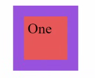


Con `border-box`, invece, padding e border sono inclusi in `width` e `height`;
il margin rimane sempre esterno.

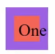

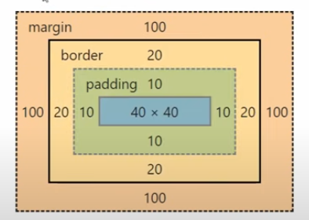

Approfondimenti:

- [Video sul box model](https://www.youtube.com/watch?v=rIO5326FgPE)
- [Box model su MDN](https://developer.mozilla.org/en-US/docs/Learn_web_development/Core/Styling_basics/Box_model)
- [Margin su CSS-Tricks](https://css-tricks.com/almanac/properties/m/margin/)

## Display: block, inline e inline-block

- `display: block` genera un box block che normalmente inizia su una nuova riga
  e occupa la larghezza disponibile.
- `display: inline`, usato per esempio da `<span>`, `<em>` e `<a>`, partecipa al
  flusso del testo. `width` e `height` non si applicano; padding e border sono
  visibili, ma quelli verticali non spostano le altre linee come in un box block.
- `display: inline-block` scorre insieme al testo ma accetta `width`, `height`,
  padding, border e margin come un box block.

Approfondimento: [inline e inline-block a confronto](https://www.digitalocean.com/community/tutorials/css-display-inline-vs-inline-block).

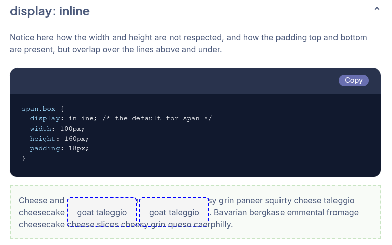

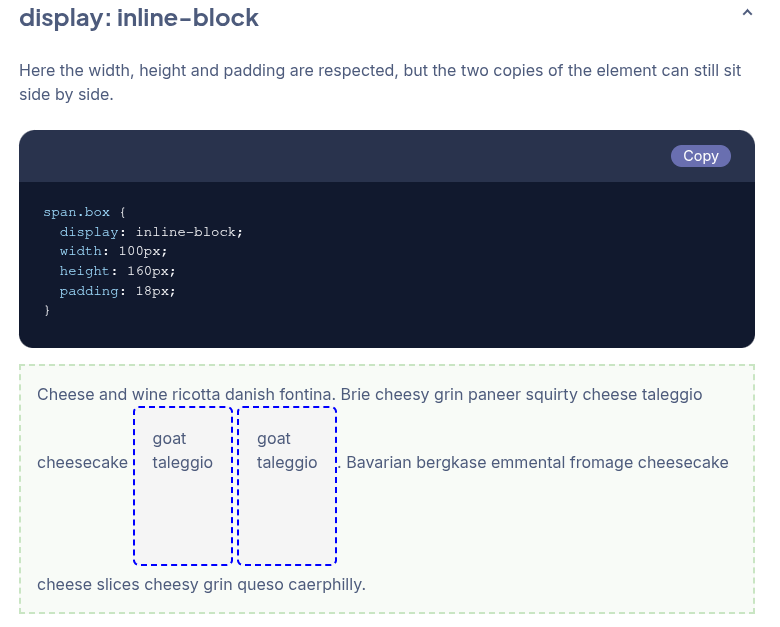

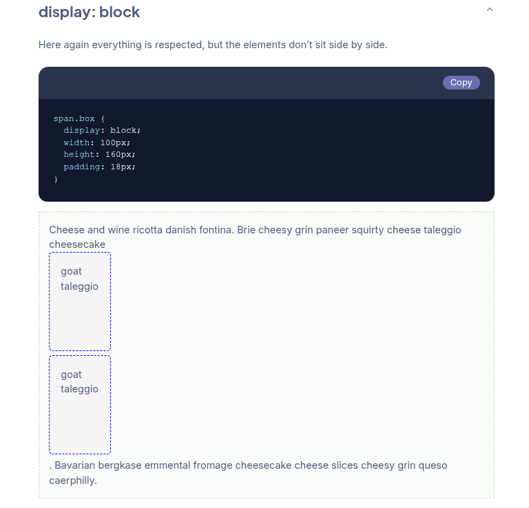

- `<div>` e `<span>` sono contenitori generici: il primo è block per default,
  il secondo inline.
- Il **normal flow** è il comportamento di layout predefinito prima di usare
  Flexbox, Grid, float o positioning. Riferimento: [elementi block e inline](https://www.w3schools.com/html/html_blocks.asp).

## Flexbox: `display: flex`

- L'elemento con `display: flex` diventa un **flex container**.
- Solo i suoi figli diretti diventano **flex item**. Le proprietà del container
  ne controllano direzione, allineamento, spaziatura e wrapping; non si tratta
  di ereditarietà CSS.
- Un flex item può essere regolato con `flex`, `flex-grow`, `flex-shrink`,
  `flex-basis`, `align-self` e `order`, oltre alle normali proprietà CSS.

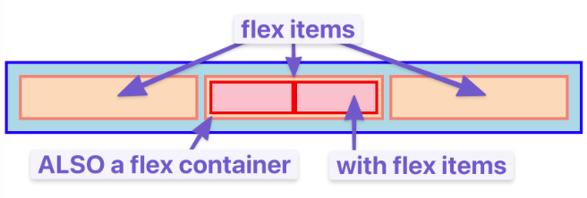

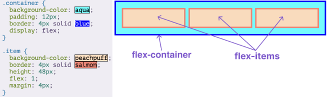

Flexbox può essere ricorsivo:

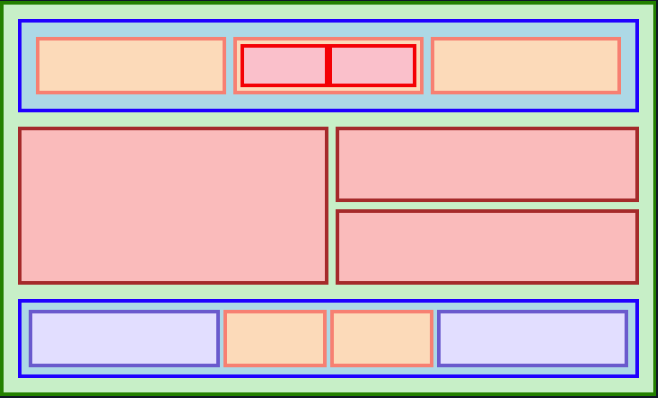

Un flex item può a sua volta diventare un flex container, ma gli elementi
annidati non diventano flex item finché il loro genitore non riceve
`display: flex`. Approfondimento: [guida visuale a Flexbox](https://www.youtube.com/watch?v=phWxA89Dy94).

### Flexbox per contenitori

#### `display: flex`

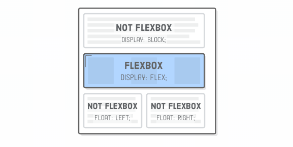

#### `justify-content`

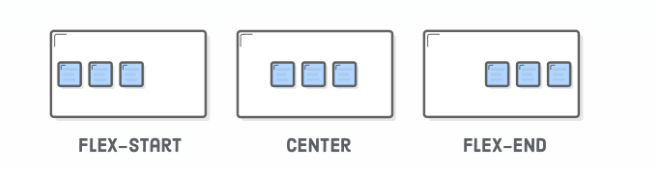

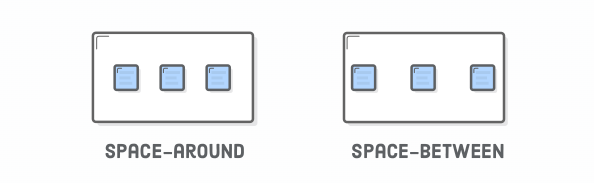

Se gli item crescono fino a occupare tutto lo spazio disponibile,
`justify-content` non ha spazio libero da distribuire.

#### `gap`

`gap` definisce la distanza tra gli item senza aggiungere margini esterni prima
del primo o dopo l'ultimo elemento.

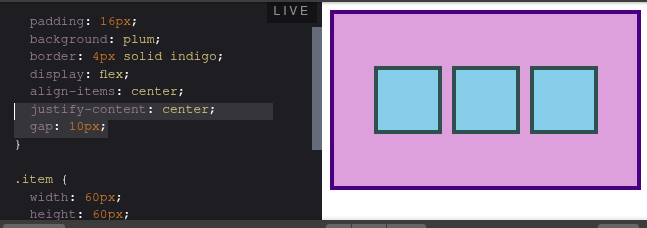

Mentalmente diventa (no margin-left su [1] e margin-right su [3]):

```
[1] 10px [2] 10px [3]
```

#### `align-items`

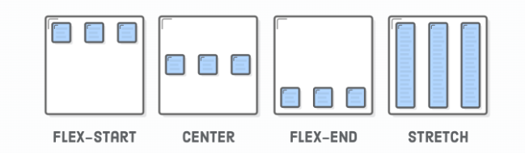

#### `flex-direction` (default: `row`)

`flex-direction` stabilisce il verso dell'asse principale. L'asse trasversale
rimane perpendicolare: con `row` è verticale, con `column` è orizzontale.

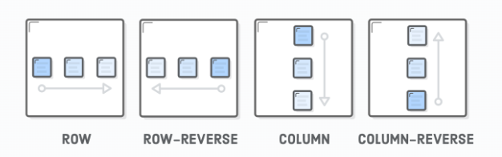

`justify-content` opera sull'asse principale; `align-items` sull'asse
trasversale. `flex-basis` misura la dimensione iniziale lungo l'asse principale,
quindi con `column` è legato all'altezza. Non è però necessario impostarlo ad
`auto` per evitare un'altezza nulla.

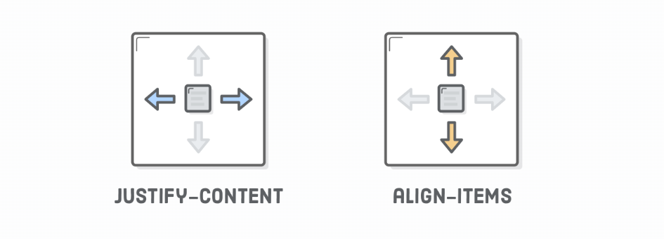

#### Grouping (concetto, non comando)

```html
<div class='menu'>
  <div class='date'>Aug 14, 2016</div>
  <div class='links'>
    <div class='signup'>Sign Up</div>      <!-- This is nested now -->
    <div class='login'>Login</div>         <!-- This one too! -->
  </div>
</div>
```

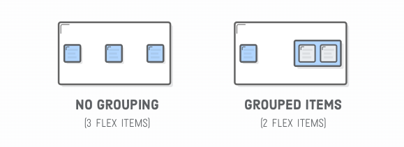

#### `flex-wrap`

Il valore predefinito è `nowrap`; `wrap` crea nuove righe o colonne quando lo
spazio non basta. Esiste anche `wrap-reverse`.

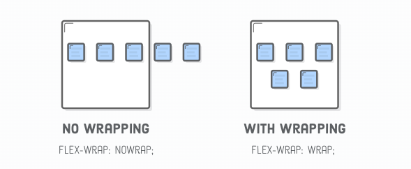

Esempio:

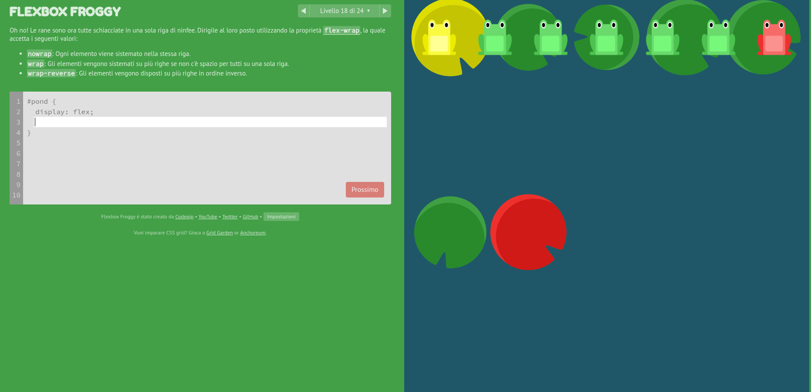

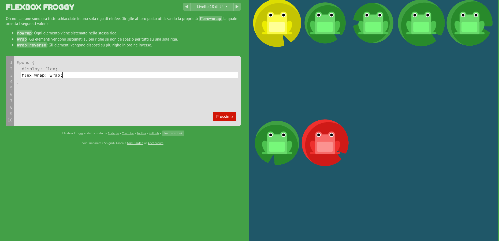

#### `align-content` (con wrap)

`align-content` distribuisce le **linee** lungo l'asse trasversale quando il
container ha più linee e rimane spazio libero. Non allinea i singoli item e non
ha effetto utile su una sola linea.

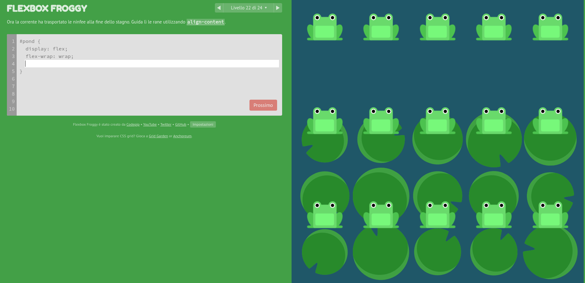

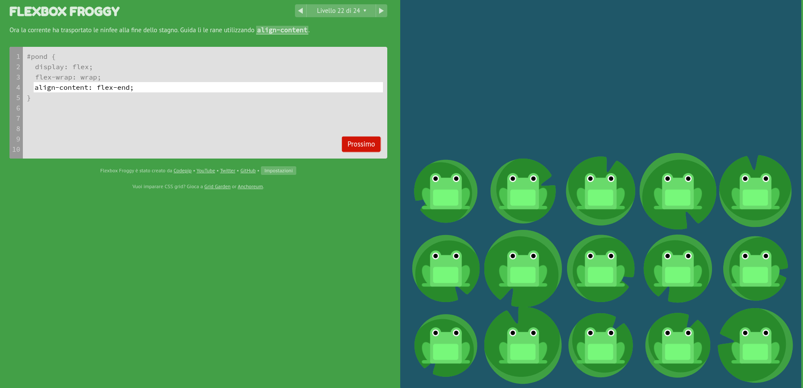

### Flexbox per gli item

#### `flex: 1`

```css
flex-grow: 1;   /* può crescere */
flex-shrink: 1; /* può restringersi */
flex-basis: 0%; /* base iniziale nulla */
```

```css
flex: <grow> <shrink> <basis>;
```

Per un numero positivo, `flex: 1` viene normalmente espanso a `1 1 0%`.

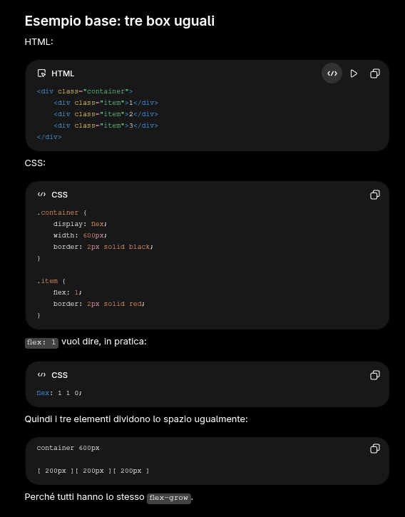

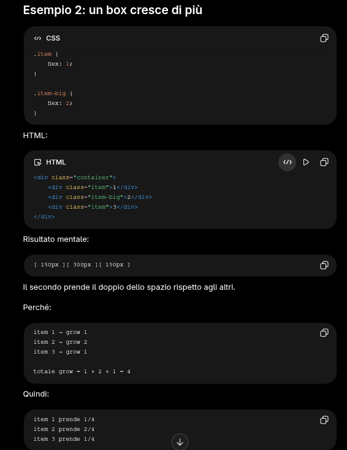

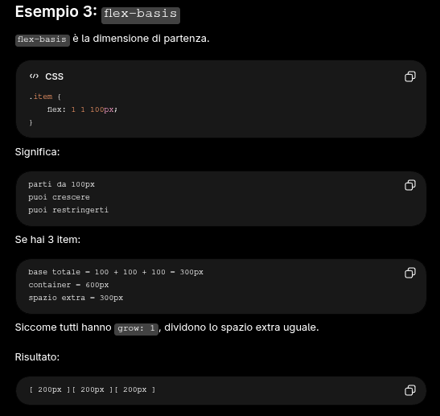

Riferimento: [proprietà `flex` su MDN](https://developer.mozilla.org/en-US/docs/Web/CSS/Reference/Properties/flex).

#### `order`

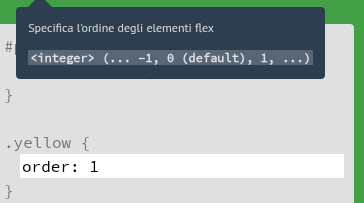


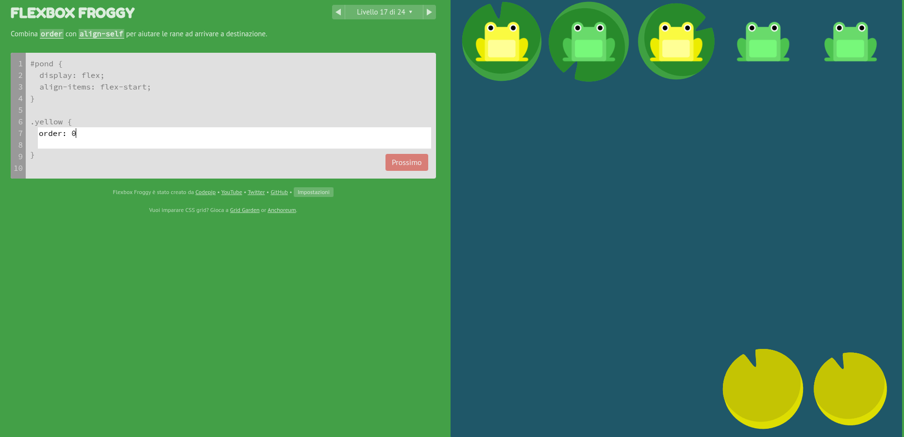

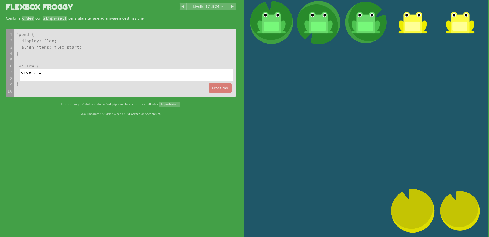

`order` cambia soltanto l'ordine visuale, non quello del DOM. Va usato con
cautela perché l'ordine di lettura e di navigazione da tastiera può rimanere
diverso.

#### `align-self`

Sovrascrive l'allineamento definito da `align-items` per un singolo flex item.

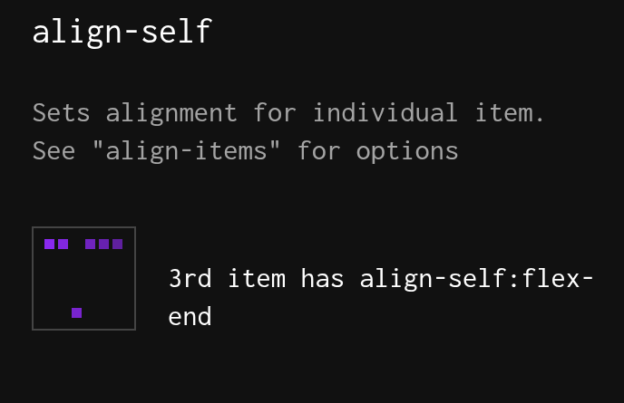

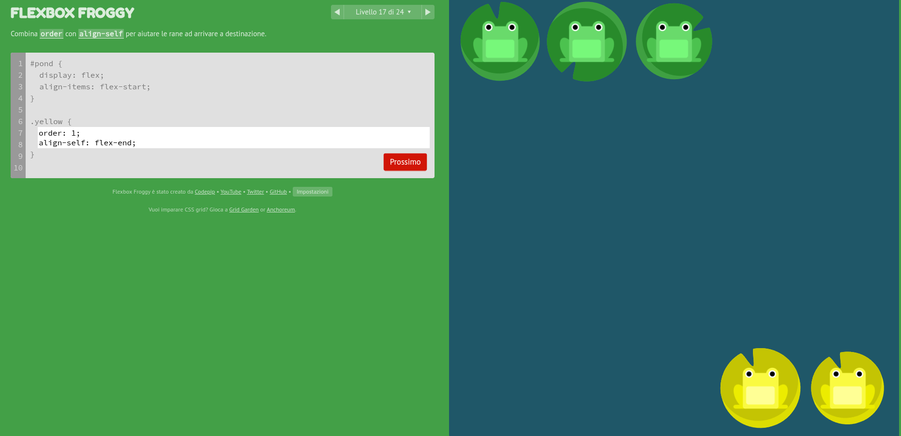

Risorse interattive:

- [Flexbox Cheatsheet](https://flexbox.malven.co/)
- [Flexbox Froggy](https://flexboxfroggy.com/#it)
- [An Interactive Guide to Flexbox](https://www.joshwcomeau.com/css/interactive-guide-to-flexbox/)

## Media query

Le media query applicano regole in base alle caratteristiche del viewport o del
dispositivo. Breakpoint come `480px`, `768px` o `1024px` sono convenzioni, non
categorie universali: è meglio scegliere il punto in cui il contenuto smette di
funzionare correttamente.

```css
body {
  min-height: 100vh;
  font-family: "Courier New", Courier, monospace;
}

/* Il layout cambia quando 768px non sono più sufficienti. */
@media (max-width: 768px) {
  .title {
    font-size: 26px;
  }

  .content {
    flex-direction: column;
    padding-bottom: 100px;
  }

  .footer {
    text-align: center;
  }
}
```

## Cose utili

### Altezza minima e sticky footer

```css
body {
  min-height: 100vh;
  display: flex;
  flex-direction: column;
}

.main {
  flex: 1;
}
```

`min-height: 100vh` fa sì che il body sia alto almeno quanto il viewport; il
contenuto principale cresce e spinge il footer in fondo anche quando la pagina è
corta. Impostare invece una `min-width` fissa sul body può introdurre scroll
orizzontale sui dispositivi stretti e non sostituisce un layout responsive.

### `.class h1` e `.class > h1`

- `.class h1` seleziona qualsiasi `h1` discendente da `.class`, anche se
  profondamente annidato.
- `.class > h1` seleziona soltanto gli `h1` che sono figli diretti di `.class`.

Il combinatore va scelto in base alla struttura che il componente intende
esporre, non soltanto in base a quale selettore sembra meno rigido.
