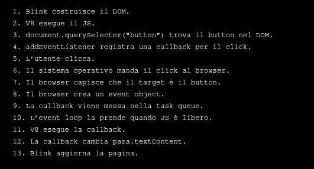
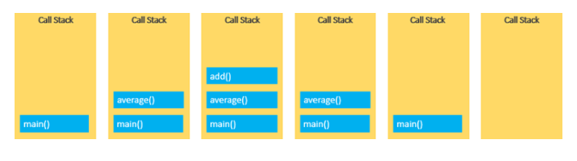
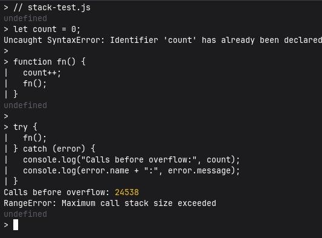
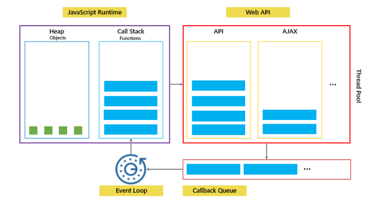
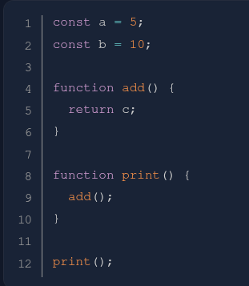
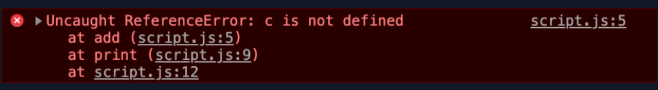
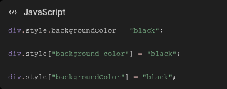
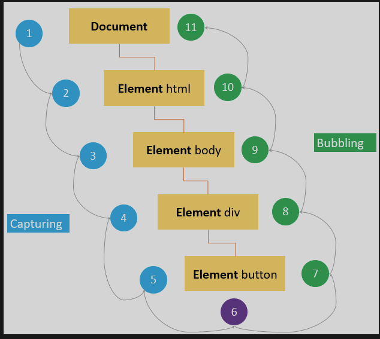
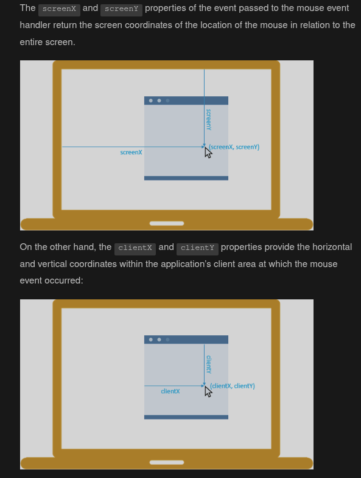

JavaScript viene eseguito dai motori integrati nei browser. Runtime come
Node.js permettono di usarlo anche fuori dal browser, per esempio nel terminale
o su un server.

## Includere JavaScript

Internamente:

```html
<body>
  <script>
    console.log("Hello, World!");
  </script>
</body>
```

Esternamente:

```html
<script src="javascript.js" defer></script>
```

Con `defer`, lo script esterno viene scaricato senza bloccare il parsing HTML e
viene eseguito dopo che il documento è stato analizzato.

## Variabili

- `let` dichiara un binding riassegnabile con scope di blocco.
- `const` dichiara un binding non riassegnabile con scope di blocco; gli oggetti
  assegnati a una costante possono comunque essere modificati.
- `var` ha scope di funzione e regole di hoisting diverse. Esiste ancora, ma nel
  codice moderno si preferiscono normalmente `const` e `let`.

```js
const PI = 3.14;
let age = 11;
age = 12;

console.log(PI + age);
```

## NVM, Node.js, npm e npx

- **Node.js** è un runtime JavaScript fuori dal browser e include una REPL
  (Read-Eval-Print Loop).
- **NVM** (Node Version Manager) installa e seleziona versioni diverse di
  Node.js, utile quando i progetti hanno requisiti incompatibili.
- **npm** gestisce pacchetti, dipendenze e script del progetto.
- **npx** è un'interfaccia di `npm exec`: esegue il binario di un pacchetto
  locale oppure, con conferma, usa una versione scaricata nella cache npm.

### Installazione

```bash
sudo pacman -S nvm

# NVM modifica PATH e versione attiva di Node.js; su Arch va inizializzato.
echo 'source /usr/share/nvm/init-nvm.sh' >> ~/.bashrc
source ~/.bashrc

nvm --version
nvm install --lts
node -v
npm -v
npx -v

# Ignora, durante la risoluzione, release pubblicate da meno di 3 giorni.
# Richiede una versione di npm che supporti min-release-age.
npm config set min-release-age=3
```

`min-release-age` misura **giorni**, non anni. Può ridurre l'esposizione a una
release appena compromessa, ma non sostituisce lockfile, audit e revisione delle
dipendenze; può inoltre ritardare una patch di sicurezza urgente.

### Usare la REPL

- Apri il terminale ed esegui `node`.
- Chiudi la REPL con `.exit`

### Differenza tra `npm` e `npx`

- `npm` serve soprattutto a **installare e gestire pacchetti**.
    - `npm install lodash` installa `lodash` nel progetto.
    - `npm install` → installa tutte le dipendenze scritte nel `package.json`.

Dopo un'installazione locale, il pacchetto viene salvato in `node_modules/` e
registrato in `package.json` e `package-lock.json`.

- `npx` serve a **eseguire un pacchetto/comando npm**, spesso senza installarlo globalmente.

La `x` puoi ricordarla come:

Per esempio, `npx cowsay "Hello Andrea"` può usare una dipendenza locale o
scaricare il pacchetto nella cache, senza richiedere `npm install -g cowsay`.

Esempio pratico:

- non voglio necessariamente tenere `create-vite` installato per sempre. Serve solo lanciarlo una volta per generare il progetto.

Quindi:

```bash
npx create-vite@latest my-app
cd my-app
npm install
npm run dev
```

## Differenza tra API e libreria

- Un'API è un'interfaccia: definisce operazioni, parametri e risultati attraverso
  cui due componenti software comunicano.

Sono comandi/metodi che ti vengono messi a disposizione:

```js
document.querySelector();
canvas.getContext();
ctx.fillRect();
fetch();
localStorage.setItem();
```

- Una libreria è **codice già scritto** che aggiungi al progetto.

```
three.js
React
Lodash
Axios
Bootstrap
jQuery
```

Tu la importi e poi usi le sue funzioni/classi:

```js
import * as THREE from "three";
```

A quel punto puoi usare l’API di three.js:

```js
const scene = new THREE.Scene();
```

## Tipi di dato comuni

JavaScript ha sette tipi primitivi e il tipo non primitivo `object`.

### Tipi primitivi

- `number` rappresenta numeri IEEE 754 in doppia precisione. L'intervallo
  `±(2^53 - 1)` riguarda gli **interi rappresentabili esattamente**, non tutti i
  valori `number`; esistono inoltre `Infinity`, `-Infinity` e `NaN`.
- `bigint` rappresenta interi di grandezza arbitraria, per esempio `123n`.
- `string` rappresenta sequenze di caratteri; non esiste un tipo separato per
  il singolo carattere.
    
    ```js
    const str = "Hello";
    const str2 = 'Anche gli apici singoli sono validi';
    const phrase = `Una template literal può includere: ${str}`;
    ```
    
- `boolean` rappresenta i valori logici `true` e `false`.
- `null` rappresenta intenzionalmente l'assenza di un valore.
- `undefined` è il valore tipico di un binding o di una proprietà non definiti.
- `symbol` crea identificatori primitivi univoci.

### Tipo non primitivo

- `object` rappresenta collezioni di proprietà e strutture più complesse;
  funzioni e array sono oggetti specializzati.

### `typeof`

- `typeof x` restituisce una stringa con il tipo del valore. `typeof(x)` è
  equivalente, ma le parentesi appartengono all'espressione e non a una
  chiamata di funzione.
- `typeof null` restituisce storicamente `"object"`, anche se `null` è un
  primitivo.

## Condizionali

### if, else if & else

```html
<label for="weather">Select the weather type today: </label>
<select id="weather">
  <option value="">--Make a choice--</option>
  <option value="sunny">Sunny</option>
  <option value="rainy">Rainy</option>
  <option value="snowing">Snowing</option>
  <option value="overcast">Overcast</option>
</select>

<p></p>
```

```js
const select = document.querySelector("select");
const para = document.querySelector("p");

select.addEventListener("change", setWeather);

function setWeather() {
  const choice = select.value;

  if (choice === "sunny") {
    para.textContent =
      "It is nice and sunny outside today. Wear shorts! Go to the beach, or the park, and get an ice cream.";
  } else if (choice === "rainy") {
    para.textContent =
      "Rain is falling outside; take a rain coat and an umbrella, and don't stay out for too long.";
  } else if (choice === "snowing") {
    para.textContent =
      "The snow is coming down — it is freezing! Best to stay in with a cup of hot chocolate, or go build a snowman.";
  } else if (choice === "overcast") {
    para.textContent =
      "It isn't raining, but the sky is grey and gloomy; it could turn any minute, so take a rain coat just in case.";
  } else {
    para.textContent = "";
  }
}
```

Oppure:

```js
const select = document.querySelector("select");
const para = document.querySelector("p");

select.addEventListener("change", setWeather);

function setWeather() {
  const choice = select.value;

  switch (choice) {
    case "sunny":
      para.textContent =
        "It is nice and sunny outside today. Wear shorts! Go to the beach, or the park, and get an ice cream.";
      break;
    case "rainy":
      para.textContent =
        "Rain is falling outside; take a rain coat and an umbrella, and don't stay out for too long.";
      break;
    case "snowing":
      para.textContent =
        "The snow is coming down — it is freezing! Best to stay in with a cup of hot chocolate, or go build a snowman.";
      break;
    case "overcast":
      para.textContent =
        "It isn't raining, but the sky is grey and gloomy; it could turn any minute, so take a rain coat just in case.";
      break;
    default:
      para.textContent = "";
  }
}
```

### Istruzione `switch`

```js
switch (expression) {
  case choice1:
    // run this code
    break;

  case choice2:
    // run this code instead
    break;

  // include as many cases as you like

  default:
    // actually, just run this code
    break;
}
```

### Operatore ternario

```js
condition ? valueIfTrue : valueIfFalse;
```

```html
<label for="theme">Select theme: </label>
<select id="theme">
  <option value="white">White</option>
  <option value="black">Black</option>
</select>

<h1>This is my website</h1>
```

```js
const select = document.querySelector("select");
const html = document.querySelector("html");
document.body.style.padding = "10px";

function update(bgColor, textColor) {
  html.style.backgroundColor = bgColor;
  html.style.color = textColor;
}

select.addEventListener("change", () =>
  select.value === "black"
    ? update("black", "white")
    : update("white", "black"),
);
```

[Altri esempi sui condizionali](https://developer.mozilla.org/en-US/docs/Learn_web_development/Core/Scripting/Conditionals).

### Debugger e DevTools

```
Step into
→ entra nella funzione chiamata

Step over
→ esegue la riga senza entrare nelle funzioni

Step out
→ esce dalla funzione corrente

Continue
→ continua fino al prossimo breakpoint o alla fine
```

Approfondimenti:

- [Ispezionare il CSS](https://developer.chrome.com/docs/devtools/css?hl=it)
- [Riferimento del pannello Elements](https://developer.chrome.com/docs/devtools/css/reference?hl=it)
- [Modificare il DOM](https://developer.chrome.com/docs/devtools/dom?hl=it)
- [Breakpoint JavaScript](https://developer.chrome.com/docs/devtools/javascript/breakpoints?hl=it)
- [Debugging in Chrome](https://javascript.info/debugging-chrome)

## Funzioni

### Dichiarazione di funzione

```js
console.log(square(3));

// Con hoisting la posso definire anche dopo la chiamata
function square(num) {
  return num * num;
}
```

### Function expression

Una funzione è un valore e può essere assegnata a una variabile o passata come
callback. Il nome interno è utile negli stack trace.

```js
const square = function square(num) {
  return num * num;
};

console.log(square(3));
```

### Arrow function

```js
const squareLong = (num) => {
  return num * num;
};

const squareShort = (num) => num * num;

console.log(squareShort(4)); // 16
```

### Event listener

```js
input.addEventListener("change", () => {
  console.log(input.value);
});

input.addEventListener("change", (event) => {
  console.log(event.target.value);
});
```

## Eventi sotto il cofano

```
utente clicca un bottone        → click event
utente scrive in un input       → input event
utente cambia valore input      → change event
utente muove il mouse           → mousemove event
pagina finisce di caricarsi      → load event
utente preme un tasto           → keydown event
form viene inviato              → submit event
```

- Quando succede un evento, il browser crea anche un **event object**, cioè un oggetto con informazioni su quello che è successo.

Dentro `event` trovo queste info:

```
event.type      → tipo evento, es. "click"
event.target    → elemento che ha generato l’evento
event.timeStamp → quando è successo
```

- Il browser è sempre in ascolto: click, tastiera, mouse, form, caricamento pagina. Con `addEventListener` scegli **quali eventi ti interessano** e **che codice eseguire quando arrivano**.

```js
button.addEventListener("click", (event) => {
  console.log(event.type);   // "click"
  console.log(event.target); // il button cliccato
});
```

### Flusso nel browser: Blink, V8 e sistema operativo



## Callback

- In pratica eseguo una funzione dentro un’altra funzione quando ne ho bisogno (occhio alla sintassi)
- `addEventListener("event-type", callback)` e `setInterval(callback, 1000)` sono due esempi comuni

```js
function sayHello() {
  console.log("Hello!");
}

function runSomething(callback) {
  callback();
}

runSomething(sayHello);
```

- `sayHello` → rappresenta la funzione stessa
- `sayHello()` → è un comando che esegue quella funzione

## Call stack

[Approfondimento sulla call stack](https://www.javascripttutorial.net/javascript-call-stack/).

- Un programma gestisce le chiamate di funzione con una pila LIFO.

```js
function add(a, b) {
    return a + b;
}

function average(a, b) {
    return add(a, b) / 2;
}

const x = average(10, 20);
```

Segue questa call stack:



### Stack overflow

La struttura dati stack ha memoria limitata: troppe chiamate causano **stack overflow**

```js
// funzione ricorsiva
function fn() {
    fn();
}

fn(); // dà stack overflow
```



## Memoria heap

- In un modello semplificato, la **stack** conserva i frame delle chiamate e la
  **heap** ospita oggetti e altri dati gestiti dinamicamente. I dettagli concreti
  dipendono dal motore JavaScript.
- Il garbage collector può recuperare un oggetto quando non è più raggiungibile;
  non esiste una garanzia sul momento esatto in cui la memoria verrà liberata.

```js
function createUser() {
  const user = {
    name: "Andrea",
    age: 31
  };

  return user;
}

const me = createUser(); // me conserva un riferimento all'oggetto
```

```
1. Entri in createUser()
2. Viene creato un object: { name: "Andrea", age: 31 }
3. L’object viene messo nella heap
4. La variabile user contiene un riferimento a quell’object
5. return user restituisce quel riferimento
6. createUser() finisce
7. L’object resta vivo perché const me lo sta ancora riferendo
```

## AJAX e Fetch API

AJAX significa *Asynchronous JavaScript and XML*, ma oggi i dati vengono spesso
scambiati come JSON. Il termine descrive richieste asincrone e aggiornamenti
parziali dell'interfaccia senza ricaricare l'intera pagina.

Senza AJAX:

```
clicchi “Mostra meteo”
→ il browser ricarica tutta la pagina
```

Con AJAX:

```
clicchi “Mostra meteo”
→ JS chiede i dati al server
→ arriva risposta (quasi sempre in formato JSON)
→ aggiorni solo un div
```

### Promise con `.then()`

```html
<button id="load-user">Load user</button>
<p id="result"></p>
```

```js
const button = document.querySelector("#load-user");
const result = document.querySelector("#result");

button.addEventListener("click", () => {
  fetch("https://example.com/user")
    .then((response) => {
      if (!response.ok) {
        throw new Error(`HTTP ${response.status}`);
      }
      return response.json();
    })
    .then((data) => {
      result.textContent = data.name;
    })
    .catch((error) => {
      result.textContent = `Errore: ${error.message}`;
    });
});
```

### La stessa richiesta con `async`/`await`

```js
const button = document.querySelector("#load-user");
const result = document.querySelector("#result");

button.addEventListener("click", async () => {
  try {
    const response = await fetch("https://example.com/user");
    if (!response.ok) {
      throw new Error(`HTTP ${response.status}`);
    }

    const data = await response.json();
    result.textContent = data.name;
  } catch (error) {
    result.textContent = `Errore: ${error.message}`;
  }
});
```

`fetch()` non rigetta la promise per risposte HTTP come `404` o `500`: per
questo gli esempi controllano esplicitamente `response.ok`.

## Event loop e JavaScript asincrono

[Approfondimento sull'event loop](https://www.javascripttutorial.net/javascript-event-loop/).



- Il codice sincrono viene eseguito sulla call stack.
- Il browser gestisce timer, rete e altri lavori tramite Web API esterne alla
  stack JavaScript.
- Quando la stack è vuota, l'event loop esegue prima le microtask in attesa
  (per esempio le reazioni delle promise) e poi una task dalla task queue (per
  esempio timer o eventi UI). Promise e timer non condividono quindi una sola
  “callback queue”.

## Problem solving

La sintassi è uno strumento; prima di scrivere codice bisogna capire il problema.

1. Definisci input, output, vincoli e casi limite.
2. Dividi il problema in parti verificabili.
3. Scrivi pseudocodice senza dipendere dalla sintassi del linguaggio.
4. Implementa e prova esempi normali, limiti ed errori.

### Esempio: FizzBuzz

Il programma riceve un intero positivo e stampa i valori da `1` al limite. Per i
multipli di `3` stampa `Fizz`, per quelli di `5` stampa `Buzz` e per i multipli
di entrambi stampa `FizzBuzz`.

Pseudocodice:

```text
leggi il limite
se il limite non è un intero positivo, mostra un errore
per ogni numero da 1 al limite:
    se è divisibile per 15, stampa FizzBuzz
    altrimenti se è divisibile per 3, stampa Fizz
    altrimenti se è divisibile per 5, stampa Buzz
    altrimenti stampa il numero
```

```js
const readline = require("node:readline/promises").createInterface({
  input: process.stdin,
  output: process.stdout,
});

function fizzBuzz(limit) {
  for (let number = 1; number <= limit; number += 1) {
    if (number % 15 === 0) {
      console.log("FizzBuzz");
    } else if (number % 3 === 0) {
      console.log("Fizz");
    } else if (number % 5 === 0) {
      console.log("Buzz");
    } else {
      console.log(number);
    }
  }
}

async function main() {
  const answer = await readline.question("Inserisci un intero positivo: ");
  const limit = Number(answer);

  if (!Number.isSafeInteger(limit) || limit < 1) {
    console.error("Valore non valido.");
    readline.close();
    return;
  }

  fizzBuzz(limit);
  readline.close();
}

main();
```

- [Video sul problem solving](https://www.youtube.com/watch?v=azcrPFhaY9k)
- [Introduzione allo pseudocodice](https://builtin.com/data-science/pseudocode)
- [How to Think Like a Programmer](https://www.freecodecamp.org/news/how-to-think-like-a-programmer-lessons-in-problem-solving-d1d8bf1de7d2/)

## Errori

[Guida MDN agli errori JavaScript](https://developer.mozilla.org/en-US/docs/Learn_web_development/Core/Scripting/What_went_wrong).

- `SyntaxError`: il parser incontra sintassi non valida.
- `ReferenceError`: il codice usa un identificatore non disponibile nello scope,
  per esempio `cnsole` al posto di `console`.
- `TypeError`: un valore non supporta l'operazione richiesta, per esempio
  chiamare qualcosa che non è una funzione.
    

### Stack trace





Segue i passi dell’errore:

Lo stack trace mostra il punto dell'errore e la catena delle chiamate: nell'esempio
la riga 12 chiama `print`, che chiama `add`, dove nasce il problema.

### Avvisi

Un warning segnala un problema potenziale, ma normalmente non interrompe
l'esecuzione.

## Clean code

### Nomi e variabili

- `greeting` meglio di `x`.
    - Variabili = **Sostantivi** (`userCount`);
    - Funzioni = **Verbi** (`getUser()`).
- Usa lo stesso verbo per azioni simili: `getUserData`, `getUserInput`.
- **Numeri fissi in costanti:** (es. `const SECONDS_IN_HOUR`).
- In JS Usa `camelCase` (tranne costanti in `ALL_CAPS`).

### Stile e formattazione

- Scegli spazi o tab e applica la scelta in modo coerente, preferibilmente con
  formatter e linter.
- Il punto e virgola non è sempre obbligatorio grazie all'Automatic Semicolon
  Insertion, ma uno stile coerente evita casi ambigui.
- Una lunghezza massima vicina a 80–100 caratteri è una linea guida, non una
  regola del linguaggio.

```js
const total =
  firstValue +
  secondValue +
  thirdValue;
```

### Commenti

- Spiega il **PERCHÉ**, non il **COME**.
- **No pseudocodice:** Se il codice è chiaro, il commento è inutile.
- **Non commentare codice vecchio** o "commentato per sicurezza". Usa **Git**.

### Principio guida

- **Leggibilità > Perfezione:** Il codice si legge più di quanto si scrive.

Il codice dovrebbe rimanere comprensibile anche senza commenti; i commenti
servono soprattutto a spiegare decisioni, vincoli e motivazioni non evidenti.

## Cicli

### Ciclo `for`

```js
for (let i = 0; i < 100; i++) {
  console.log("Hello world");
}
```

- `for … of …` per iterare array

```js
const cats = ["Leopard", "Serval", "Jaguar", "Tiger", "Caracal", "Lion"];

for (const cat of cats) {
  console.log(cat);
}
```

- `break` interrompe completamente il loop

```js
for (let i = 0; i < 10; i++) {
  if (i === 5) {
    break;
  }
  console.log(i);
} // Output: 0 1 2 3 4
```

- `continue` salta un’iterazione

```js
for (let i = 0; i < 10; i++) {
  if (i === 5) {
    continue;
  }
  console.log(i);
} // Output: 0 1 2 3 4 6 7 8 9
```

### While

```js
let value = initializer;
while (condition) {
  // codice da ripetere
  value = nextValue;
}
```

- `do while`

Il blocco viene eseguito almeno una volta, poi viene controllata la condizione.

```js
let value = initializer;
do {
  // codice eseguito almeno una volta
  value = nextValue;
} while (condition);
```

## Array

[Introduzione visuale agli array](https://www.youtube.com/watch?v=7W4pQQ20nJg).

## Metodi degli array: `map`, `filter` e `reduce`

- `map()` trasforma ogni elemento e crea un nuovo array
- `filter()` tiene solo alcuni elementi e crea un nuovo array
- `reduce()` riduce tutto l’array a un singolo valore finale

Vengono spesso usati con funzioni di callback, in particolare arrow function.

`map()` e `filter()` restituiscono nuovi array; `reduce()` restituisce il valore
accumulato. Questi metodi non modificano direttamente l'array di origine, anche
se una callback può comunque mutare oggetti condivisi.

Attenzione: altri metodi come `push`, `pop`, `sort`, `splice` modificano l’array originale.

```js
// ------------MAP---------------------------------------
const cats = ["Leopard", "Serval", "Jaguar", "Tiger", "Caracal", "Lion"];
const upperCats = cats.map((cat) => cat.toUpperCase());
console.log(upperCats);
// OUT: [ "LEOPARD", "SERVAL", "JAGUAR", "TIGER", "CARACAL", "LION" ]

// ------------FILTER------------------------------------
const filtered = cats.filter((cat) => cat.startsWith("L"));
console.log(filtered);
// OUT: [ "Leopard", "Lion" ]

// ------------REDUCE------------------------------------
const numbers = [1, 2, 3, 4];
const sumWithInitial = numbers.reduce((accumulator, current) => {
  return accumulator + current;
}, 0); // 0 initial value for accumulator

console.log(sumWithInitial); // 10

// Senza valore iniziale, reduce usa il primo elemento come accumulatore.
const sumWithoutInitial = numbers.reduce((acc, number) => acc + number);
```

- Esempio Minimale

```js
const numbers = [1, 2, 3, 4, 5];

const doubled = numbers.map((number) => number * 2);
const evens = numbers.filter((number) => number % 2 === 0);
const sum = numbers.reduce((acc, n) => acc + n, 0);
```

```js
const numbers = [1, 2, 3, 4, 5];

function sumOfTripledEvens(values) {
  return values
    .filter((number) => number % 2 === 0)
    .map((number) => number * 3)
    .reduce((accumulator, number) => accumulator + number, 0);
}

console.log(sumOfTripledEvens(numbers));
```

## DOM

Il Document Object Model è la rappresentazione ad albero del documento che il
browser espone a JavaScript. Include nodi element, text e altri tipi di nodo e può
cambiare dopo il parsing dell'HTML.

### Selezionare elementi

```html
<div id="container">
  <div class="display"></div>
  <div class="controls"></div>
</div>
```

```js
const container = document.querySelector("#container");
const display = container.firstElementChild;
console.log(display); // <div class="display"></div>

const controls = document.querySelector(".controls");
const previous = controls.previousElementSibling;
console.log(previous); // <div class="display"></div>
```

- `element.querySelector(selector)` restituisce il primo elemento corrispondente
  o `null`.
- `element.querySelectorAll(selector)` restituisce una `NodeList` statica con
  tutte le corrispondenze.

Una `NodeList` non è un array, anche se supporta `length`, indicizzazione e
`forEach()`. Per usare i metodi degli array si può convertirla con
`Array.from(nodes)` o `[...nodes]`; vedi lo [spread operator](https://developer.mozilla.org/en-US/docs/Web/JavaScript/Reference/Operators/Spread_syntax).

### Creare, inserire e rimuovere nodi

L’elemento è in memoria, ma non entra nel DOM

```js
const div = document.createElement("div");
```

- Inserimento: `parent.append(child)`, `parent.appendChild(child)` oppure
  `parent.insertBefore(newNode, referenceNode)`.
- Rimozione: `element.remove()` oppure `parent.removeChild(child)`.

### Modificare un elemento

```js
const div = document.createElement("div");

div.style.color = "blue";
// setAttribute sostituisce l'intero attributo style esistente.
div.setAttribute("style", "color: blue; background: white;");

div.setAttribute("id", "theDiv");
div.setAttribute("class", "div-class");
div.getAttribute("id");
div.removeAttribute("id");

div.classList.add("new");
div.classList.remove("new");
div.classList.toggle("active");

// Interpreta il valore come testo.
div.textContent = "Hello World!";
// Interpreta il valore come HTML: mai inserire input non fidato.
div.innerHTML = "<span>Hello World!</span>";
```

### Esempi

- Esempio di sintassi valida per cambiare lo stile inline degli elementi



- Esempio di funzionamento `setAttribute` e `appendChild` per messaggio di errore password

```js
const message = document.createElement("p");

message.textContent = "Password non valida";

message.setAttribute("id", "login-error");
message.setAttribute("class", "error-message");
message.setAttribute("role", "alert");

document.body.appendChild(message);
```

- Creazione di un `div` con contenuto testuale:

```html
<body>
  <h1>THE TITLE OF YOUR WEBPAGE</h1>
  <div id="container"></div>
</body>
```

```js
const container = document.querySelector("#container");

const content = document.createElement("div");
content.classList.add("content");
content.textContent = "This is the glorious text-content!";

container.appendChild(content);
```

Il DOM risultante equivale a:

```html
<body>
  <h1>THE TITLE OF YOUR WEBPAGE</h1>
  <div id="container">
    <div class="content">This is the glorious text-content!</div>
  </div>
</body>
```

JavaScript modifica il DOM in memoria, non il file HTML sul server. Uno script
esterno con `defer` può stare in `<head>` e viene eseguito dopo il parsing, senza
doverlo collocare alla fine di `<body>`.

## Eventi

Un listener associa una callback a un tipo di evento. Riferimento: [eventi DOM](https://www.w3schools.com/jsref/dom_obj_event.asp).

Metodo consigliato:

```js
const btn = document.getElementById("btn");

btn.addEventListener("click", (e) => {
  console.log("Tipo:", e.type);
  console.log("Elemento cliccato:", e.target);
  console.log("Coordinate:", e.clientX, e.clientY);
  e.target.style.background = "blue";
});
```

Metodi sconsigliati:

```html
<button onclick="alert('Hello World')">Click Me</button>
```

```js
const btn = document.querySelector("#btn");
btn.onclick = () => alert("Hello World");
```

Entrambe le forme agiscono sull'elemento scelto, non su tutti i bottoni. Sono
però meno flessibili: l'attributo inline mescola HTML e JavaScript, mentre la
proprietà `onclick` può conservare un solo handler. `addEventListener()` permette
più listener e opzioni come `once`, `capture` e `signal`.

### Collegare listener a una NodeList

```html
<div id="container">
  <button id="one">Click Me</button>
  <button id="two">Click Me</button>
  <button id="three">Click Me</button>
</div>
```

```js
const buttons = document.querySelectorAll("button");

buttons.forEach((button) => {
  button.addEventListener("click", () => {
    alert(button.id);
  });
});
```

### Approfondimenti



**Propagazione di un evento nel DOM:** l’evento attraversa prima la fase di capturing, scendendo da `Document` fino all’elemento target; raggiunge poi il bottone cliccato e risale attraverso gli elementi antenati durante la fase di bubbling. Per impostazione predefinita, i listener registrati con `addEventListener()` vengono eseguiti durante il bubbling.

- [Mouse events](https://www.javascripttutorial.net/javascript-dom/javascript-mouse-events/)



- [Keyboard events](https://www.javascripttutorial.net/javascript-dom/javascript-keyboard-events/)

### Event delegation

```html
<ul id="menu">
  <li><a href="/" data-section="home">Home</a></li>
  <li><a href="/dashboard/" data-section="dashboard">Dashboard</a></li>
  <li><a href="/report/" data-section="report">Report</a></li>
</ul>
```

```js
const menu = document.querySelector("#menu");

menu.addEventListener("click", (event) => {
  const link = event.target.closest("a[data-section]");

  if (!link || !menu.contains(link)) {
    return;
  }

  console.log(`Clicked: ${link.dataset.section}`);
});
```

La delegazione sfrutta il bubbling per gestire molti elementi presenti o futuri
con un solo listener sul loro antenato comune.

### dispatchEvent()

[Approfondimento su `dispatchEvent()`](https://www.javascripttutorial.net/javascript-dom/javascript-dispatchevent/).

Normalmente browser genera eventi con

```
utente clicca
→ browser crea evento "click"
→ esegue i listener
```

Con `dispatchEvent()` posso fare cose custom via codice

```
JavaScript crea evento
→ lo invia all'elemento
→ vengono eseguiti i listener registrati
```

Esempio di codice:

```js
const cart = document.querySelector("#cart");

cart.addEventListener("productAdded", (event) => {
  console.log(`Aggiunto: ${event.detail.name}`);
  console.log(`Prezzo: ${event.detail.price}`);
});

// Creo evento
const productAddedEvent = new CustomEvent("productAdded", {
  //oggetto come secondo argomento
  detail: {
    name: "Tastiera",
    price: 49.99,
  },
  bubbles: true, // Risale ai node genitori se true
  cancelable: true, // Consente event.preventDefault().
});

// Lo evoco con dispatchEvent()
cart.dispatchEvent(productAddedEvent);
```

### Callback

[Approfondimento sulle callback](https://dev.to/i3uckwheat/understanding-callbacks-2o9e).

## Oggetti

Un oggetto è una collezione di proprietà chiave-valore. L'ereditarietà di
JavaScript si basa su catene di prototipi.

```js
const person = {
  name: ["Bob", "Smith"],
  age: 32,
  bio() {
    console.log(`${this.name[0]} ${this.name[1]} is ${this.age} years old.`);
  },
  introduceSelf() {
    console.log(`Hi! I'm ${this.name[0]}.`);
  },
};

// ---------------------------------------------

// Constructor function: per molte istanze è meglio mettere i metodi
// su Person.prototype o usare una class.
function Person(name) {
  this.name = name;
  this.introduceSelf = function () {
    console.log(`Hi! I'm ${this.name}.`);
  };
}
const salva = new Person("Salva");
salva.introduceSelf();
// "Hi! I'm Salva."

const frankie = new Person("Frankie");
frankie.introduceSelf();
// "Hi! I'm Frankie." 
```

### Primitive e riferimenti a oggetti

```js
let data = 42;
let dataCopy = data;

dataCopy = 43;

console.log(data); // 42
console.log(dataCopy); // 43
```

```js
const obj = { data: 42 };
const objCopy = obj;

// Entrambe le variabili contengono un riferimento allo stesso oggetto.
objCopy.data = 43;

console.log(obj); // { data: 43 }
console.log(objCopy); // { data: 43 }

```

```js
function increaseCounterObject(objectCounter) {
  objectCounter.counter += 1;
}

function increaseCounterPrimitive(primitiveCounter) {
  primitiveCounter += 1;
}

const object = { counter: 0 };
let primitive = 0;

increaseCounterObject(object);
increaseCounterPrimitive(primitive);

console.log(object.counter); // 1
console.log(primitive); // 0
```

JavaScript passa sempre gli argomenti **per valore**. Per un primitivo il valore
è il dato stesso; per un oggetto il valore copiato è un riferimento. Mutare
l'oggetto attraverso quel riferimento è quindi visibile al chiamante, mentre
riassegnare un parametro non cambia la variabile esterna.
