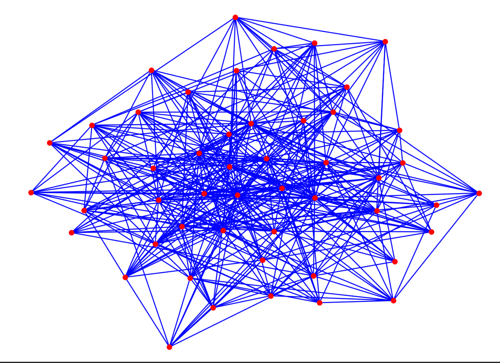
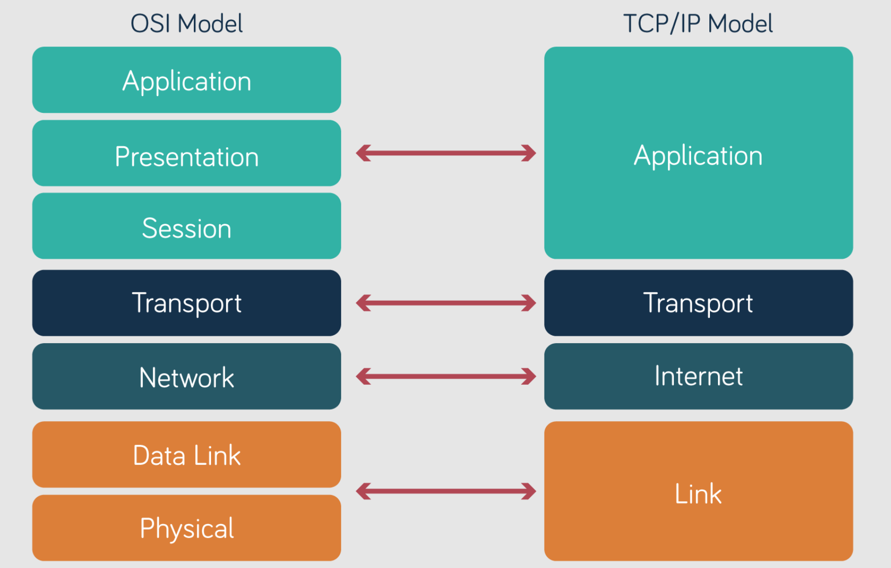
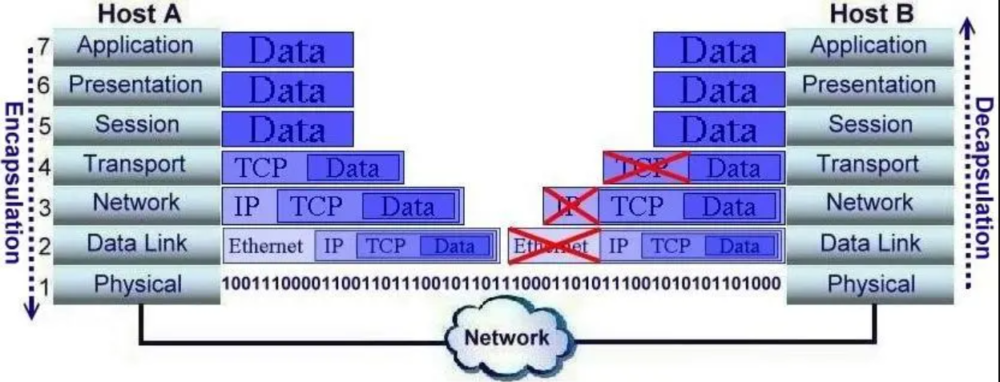

## 1. Concetti introduttivi

**Definizione:** una rete è una struttura a nodi collegati da archi
associativi che permette lo scambio di informazioni.

**Gerarchia dei dispositivi:**
`Switch` (locale) → `Router` (geografico) → `Modem` (fisico/segnale)

*La rete è un grafo.*

### Tipi di reti

#### PAN (Personal Area Network)

- Microstruttura a nodi che copre pochi metri.
- Esempio: Bluetooth.

#### LAN (Local Area Network)

- Host che comunicano tra loro tramite switch.
- Rete privata e locale.

#### WAN (Wide Area Network)

- Interconnessione di più LAN tramite router.
- Utilizza protocolli di routing (Network Layer) per instradare i pacchetti
  geograficamente.

## 2. Architettura: il modello ISO/OSI

### Perché esiste?

Per standardizzare la comunicazione attraverso uno stack protocollare ed
evitare che ogni azienda utilizzi logiche proprietarie incompatibili.

*Il modello OSI è teorico, mentre TCP/IP è lo standard implementato.*

## 3. I sette livelli dello stack OSI

I livelli sono presentati dal basso, più vicino all'hardware, verso l'alto,
più vicino al software.

### Media layers: hardware e trasporto dei dati

#### L1 — Physical Layer (fisico)

- **Cosa fa:** trasmissione fisica dei bit.
- **Mezzo:** cavo in rame, fibra oppure onde radio.
- **Indirizzamento:** nessuno.

#### L2 — Data-Link Layer (collegamento)

- **Cosa fa:** comunicazione tra dispositivi locali (LAN).
- **Dispositivo:** switch.
- **PDU (unità dati):** frame.
- **Indirizzamento:** MAC address fisico, sorgente e destinazione.

#### L3 — Network Layer (rete)

- **Cosa fa:** instradamento su reti geografiche (WAN).
- **Dispositivo:** router.
- **Protocolli:** IP (Internet Protocol) e routing con rotte statiche o
  dinamiche.
- **Indirizzamento:** indirizzo IP logico.

### Host layers: software e processi

#### L4 — Transport Layer (trasporto)

- **Cosa fa:** gestione della comunicazione end-to-end e delle sessioni
  (socket).
- **Indirizzamento:** porte, utilizzate per identificare il processo nel
  sistema operativo.
- **Protocolli:**
  - `UDP`: velocità maggiore dell'affidabilità, ad esempio nello streaming.
  - `TCP`: affidabilità maggiore della velocità, ad esempio per web e file.

#### L5 — Session Layer

Gestisce la sessione utente, inclusi sincronizzazione e login.

#### L6 — Presentation Layer

Gestisce codifica, compressione e crittografia dei dati.

#### L7 — Application Layer

Fornisce l'interfaccia utente attraverso protocolli come HTTP, DNS e quelli
utilizzati per la posta elettronica.

- **PDU:** payload (messaggio).

### Riepilogo

| Livello | Nome PDU (dati) | Indirizzamento | Dispositivo chiave |
| --- | --- | --- | --- |
| **L7 — Application** | Payload / messaggio | Email, URL | PC / server |
| **L4 — Transport** | Segmento (TCP) | Porta, ad esempio 80 o 443 | Firewall / host |
| **L3 — Network** | Pacchetto / datagramma | Indirizzo IP | Router |
| **L2 — Data-Link** | Frame | MAC address | Switch |
| **L1 — Physical** | Bit | — | Hub / cavi |

## 4. Meccanismi di comunicazione

### Adjacent layer interaction

Un livello alto chiede un servizio al livello immediatamente inferiore.

- Esempio: L7 (Application) chiede a L4 (Transport) di spedire i dati.

### Same layer interaction

È la comunicazione logica tra lo stesso livello di due host diversi.

- Esempio: il livello Transport dell'host A comunica con il livello Transport
  dell'host B.

Questo avviene attraverso incapsulamento e decapsulamento.

### Incapsulamento e decapsulamento

*La struttura dati implementata dal modello OSI è una pila.*

Il viaggio del pacchetto attraverso lo stack avviene in tre fasi:

1. **Host A (mittente):** incapsula i dati aggiungendo header e trailer.
   - `Dati` → `TCP` → `IP` → `MAC` → `Bit`.
2. **Dispositivi intermedi:**
   - Lo **switch** apre fino a L2, legge il MAC address, incapsula nuovamente
     e inoltra.
   - Il **router** apre fino a L3, legge l'indirizzo IP, cambia il MAC address
     del destinatario, incapsula nuovamente e inoltra.
3. **Host B (destinatario):** decapsula i dati rimuovendo le intestazioni.
   - Legge e rimuove gli header strato per strato fino a ottenere il payload
     pulito.

> **Nota:** un dispositivo intermedio non deve implementare l'intero stack.
> Lo switch si ferma al Layer 2, mentre il router arriva fino al Layer 3.

Per approfondire l'invio dei pacchetti in una simulazione con Cisco Packet
Tracer, consulta il
[video dedicato su YouTube](https://www.youtube.com/watch?v=9BdpA_-PHhY&list=PLod5uVuFMqhaEu_Qn9MmUbT6AiASm9Mja&index=4).
