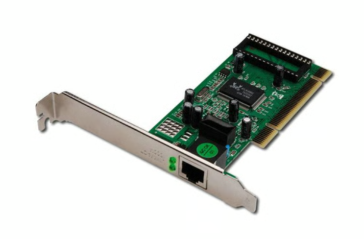
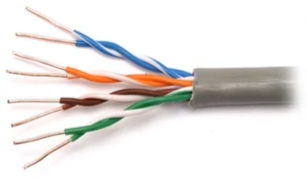
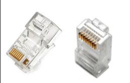
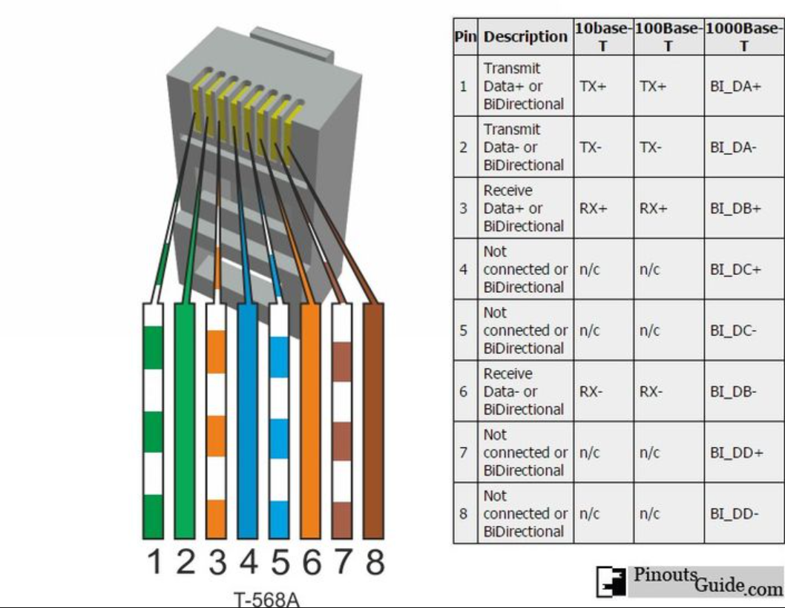
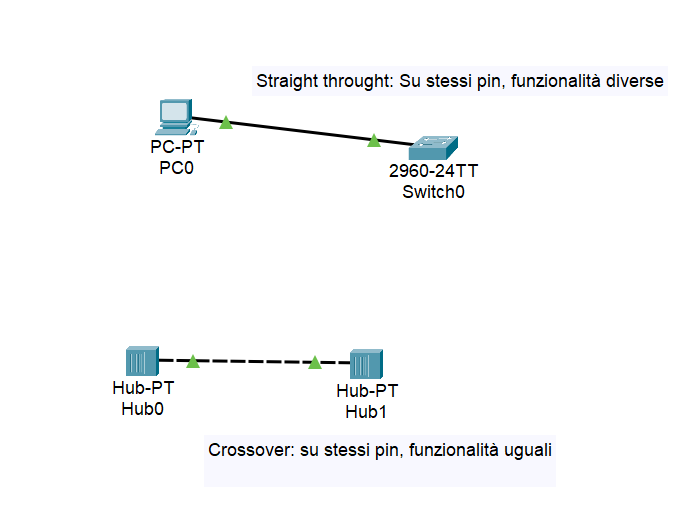
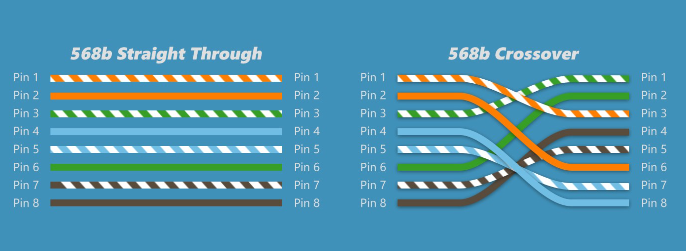

## 1. Standard IEEE e Indirizzamento

Il protocollo Ethernet definisce le regole per **la comunicazione in una LAN** operando sui livelli **L1 (Fisico)** e **L2 (Data-Link)**.

> 💡 **Standard principali:**
> 
> - **IEEE 802.3** → Reti Cablate (Ethernet standard).
> - **IEEE 802.11** → Reti Wireless (Wi-Fi, Access Point).

### MAC Address (Media Access Control)

- **Definizione:** Identificativo univoco "stampato" di fabbrica sulla scheda di rete (NIC).
- **Caratteristiche:**
    - Statico (non cambia, a differenza dell'IP che è dinamico).
    - Struttura esadecimale (48 bit).
- **Sicurezza:** È possibile modificarlo software tramite **MAC Spoofing** per mascherare la propria identità.

NIC Network Interface Controller

## 2. Evoluzione della Velocità Ethernet

La codifica del segnale avviene tramite variazioni di tensione (es. Alta tensione = `1`, Bassa tensione = `0`).

| **Nome Standard** | **Velocità (Bandwidth)** | **Sigla** |
| --- | --- | --- |
| **Ethernet** | 10 Mbps | 10BASE-T |
| **Fast Ethernet** | 100 Mbps | 100BASE-TX |
| **Gigabit Ethernet** | 1 Gbps (1000 Mbps) | 1000BASE-T |
| **10 Gigabit** | 10 Gbps | 10GBASE-T |

## 3. Hardware di Connessione

### Il Cavo: UTP (Unshielded Twisted Pair)

Cavo a **doppini intrecciati** non schermato.

- **Funzione dell'intreccio (Twist):** Serve a cancellare le interferenze elettromagnetiche (EMI) e il **Crosstalk** (diafonia), ovvero evita che il segnale di un filo disturbi quello adiacente.

### Il Connettore: RJ45

- Standard derivato dalla telefonia.
- Si inserisce nella porta della **NIC (Network Interface Controller)**.
- Contiene **8 pin** (contatti metallici) che toccano gli 8 fili di rame del cavo.

RJ-45 (Registered Jack 45 standard), dalla telefonia

### Categorie (Cat)

Standard TIA/EIA che certifica la qualità costruttiva (frequenza/velocità).

- *Vedi pagina dedicata per dettagli su Cat5e, Cat6, ecc.*

Evita interferenze elettromagnetiche e crosstalk (evita che il segnale di un cavo interferisca con quello vicino)

| **Categoria** | **Velocità Max** | **Frequenza (Larghezza di Banda)** | **Note / Utilizzo** |
| --- | --- | --- | --- |
| **Cat 5** | 100 Mbps | 100 MHz | ⛔ **Obsoleto.** Non si usa più. |
| **Cat 5e** | **1 Gbps** | 100 MHz | ✅ **Standard Base.** La "e" sta per *Enhanced* (Migliorato). Riduce le interferenze rispetto al Cat5. |
| **Cat 6** | **10 Gbps*** | 250 MHz | 🚀 **Standard Attuale.** Ideale per uffici moderni. *I 10Gbps sono garantiti solo fino a 55 metri. |
| **Cat 6a** | 10 Gbps | 500 MHz | 🏢 **Enterprise.** La "a" sta per *Augmented*. Supporta 10Gbps su lunghe distanze (100m). |
| **Cat 7/8** | 40 Gbps+ | 600-2000 MHz | 🏭 **Datacenter.** Usati per server farm, molto costosi e rigidi. |

## 4. Cablaggio e Pinout (Cable Pinout)

Il **Pinout** è lo schema che definisce l'ordine dei fili colorati all'interno del connettore RJ45.

> ⚠️ **Concetto Chiave:**
Una comunicazione avviene se c'è un circuito chiuso:
> 
> - Il pin che **INVIA (Tx)** su un lato deve collegarsi al pin che **RICEVE (Rx)** sull'altro.(Rx e Tx sono standard definiti da MDI = Media Dependent Interface)

Non tutti i pin servono a seconda della tecnologia

### Tipi di connessioni

Esempio da Cisco packet tracer

### Straight-Through (Cavo Dritto)

- **Quando si usa:** Dispositivi **DIVERSI**.
    - Host ↔ Switch
    - Router ↔ Switch
- **Logica:** I dispositivi hanno funzioni opposte sui pin (lo Switch riceve dove il PC invia). Il cavo deve essere dritto.

### Crossover (Cavo Incrociato)

- **Quando si usa:** Dispositivi **UGUALI**.
    - Host ↔ Host (PC collegati direttamente)
    - Switch ↔ Switch
- **Logica:** Se entrambi i dispositivi inviano sul pin 1, c'è collisione. Bisogna incrociare i fili nel cavo.

> 💡 **Nota su Gigabit Ethernet (1000 Mbps):**
A differenza della Fast Ethernet, la Gigabit usa **tutte e 4 le coppie (8 fili)**.
Inoltre, la maggior parte delle schede moderne supporta **Auto-MDIX**: riconoscono automaticamente il tipo di cavo e invertono i pin via software, rendendo inutile il cavo crossover manuale.
> 

[Video: cablaggio e pinout Ethernet](https://www.youtube.com/watch?v=NWhoJp8UQpo)
