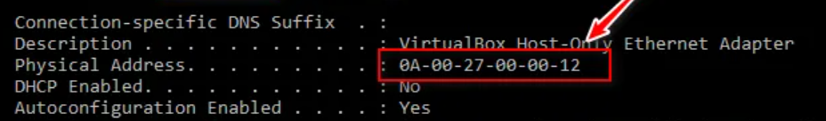
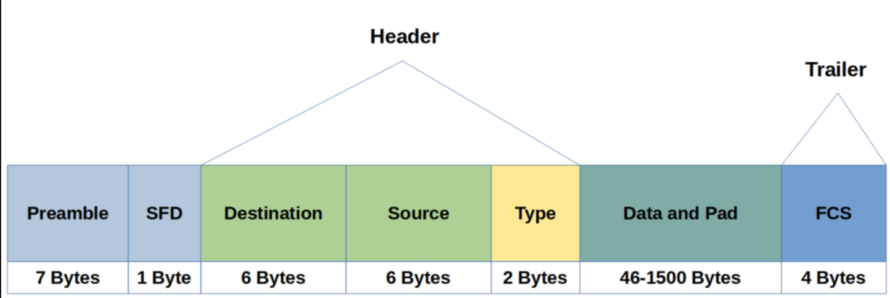
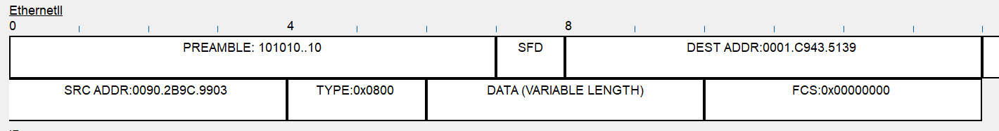

## 1. Il MAC Address (Indirizzamento Fisico)

Il **MAC (Media Access Control)** è l'indirizzo fisico "stampato" sulla scheda di rete (NIC).

- **Funzione:** Permette la consegna dei dati all'interno della stessa rete locale (LAN).
- **Protocollo ARP:** Serve a mappare l'IP (Logico) al MAC (Fisico).
    - *Regola:* Se devo uscire dalla LAN (andare su Internet), uso l'IP e passo per il Router. Se resto nella LAN, uso il MAC e passo per lo Switch.
- **Struttura:** 48 bit (6 Byte), rappresentati in esadecimale (es. `00:1A:2B:3C:4D:5E`).

### Anatomia del MAC Address

L'indirizzo è diviso in due parti uguali di 24 bit (3 Byte) ciascuna:

| Parte | Nome | Descrizione |
| --- | --- | --- |
| **Primi 3 Byte** | **OUI** (Organizationally Unique Identifier) | Codice assegnato dall'IEEE al **produttore** (es. Apple, Dell, Cisco). |
| **Ultimi 3 Byte** | **NIC Specific** (Network Interface Controller) | Numero seriale univoco assegnato dal produttore alla singola scheda. |

> 🧮 Facciamo due conti**:**
Con 24 bit dedicati alla scheda specifica, ogni produttore ha a disposizione:
> 
> 
> $2^{24}=16.777.216$
>  indirizzi univoci per ogni OUI posseduto.
> 

### ⚠️ MAC Randomization & Privacy

Su dispositivi moderni (iOS, Android, Windows 10/11), il MAC reale viene nascosto quando si fa scansione Wi-Fi.

- **Come funziona:** Il sistema genera un MAC casuale (Randomized) per ogni rete Wi-Fi a cui si connette.
- **Perché:** Per evitare il tracciamento degli utenti (es. nei centri commerciali).
- **Impatto su OSINT (Open Source INTelligence):** I tool che cercano l'OUI per identificare il dispositivo falliscono o danno "Unknown", perché il MAC casuale non appartiene a nessun vendor reale.

MAC address su Windows con comando ipconfig /all reale o spoofato

## 2. Ethernet Frame (IEEE 802.3)

Il "Frame" è l'unità dati (PDU = Protocol Data Unit) del livello 2. È il contenitore che viaggia sui cavi.
**Dimensione:** Minimo **64 byte** - Massimo **1518 byte** (Standard).

Preamble e SFD possono anche essere associati all’header del Layer 1

### A. Layer 1 (Preludio fisico)

Questi bit non contano nella grandezza del frame logico, servono a "svegliare" la scheda di rete.

1. **Preamble (7 Byte):** Sequenza alternata `10101010...`. Serve a sincronizzare i clock di ricezione (bit synchronization).
2. **SFD (Start Frame Delimiter - 1 Byte):** Sequenza `10101011`. L'ultimo bit a `1` dice: "Attenzione, da *adesso* inizia il frame vero e proprio".

### B. Header (Intestazione L2)

1. **Destination MAC (6 Byte):** Indirizzo di chi deve ricevere.
2. **Source MAC (6 Byte):** Indirizzo di chi invia.
3. **Type / Length (2 Byte):**
    - Se valore < 1500: Indica la **Lunghezza** del frame.
    - Se valore > 1536 (Hex): Indica il **Tipo di Protocollo** incapsulato (EtherType).
    - *Codici comuni:*
        - `0x0800` → IPv4
        - `0x0806` → ARP
        - `0x86DD` → IPv6

### C. Payload (Il carico utile)

1. **Data & Padding (46 - 1500 Byte):**
    - Qui dentro c'è il Pacchetto IP (o ARP).
    - **Padding (Riempimento):** Esiste una regola storica (CSMA/CD) per cui un frame **non può essere più piccolo di 64 byte**.
    - *Calcolo:* 64 byte (Min) - 18 byte (Header+Trailer) = **46 byte**.
    - Se i dati sono meno di 46 byte, si aggiungono zeri (Padding) per arrivare alla dimensione minima.

### D. Trailer (Coda)

1. **FCS (Frame Check Sequence - 4 Byte):**
    - Contiene un valore calcolato con algoritmo **CRC (Cyclic Redundancy Check)**.
    - Il ricevente ricalcola il CRC: se corrisponde a questo campo, il frame è integro. Se diverso, il frame è corrotto e viene scartato.
    

In CISCO packet tracer posso vedere l’anatomia dell’ethernet frame sopra citato ed il contenuto

Per vedere come funziona la comunicazione nel layer 2 (usando MAC tables) con cisco packet tracer:

[Video: comunicazione Layer 2 e MAC address table](https://www.youtube.com/watch?v=aeLZJgIOW6o&list=PLod5uVuFMqhaEu_Qn9MmUbT6AiASm9Mja&index=12)

## 3. MTU & Frammentazione

> **Definizione:** **MTU (Maximum Transmission Unit)**.
È la dimensione massima del *Payload* che un frame Ethernet può trasportare.
**Standard:** **1500 Byte**.
> 

**Cosa succede se i dati sono > 1500 byte?**

1. **Frammentazione IP:** Il livello Network (L3) divide il pacchetto grosso in più pacchetti piccoli che entrano nell'MTU.
2. **Jumbo Frames:** Alcune reti moderne supportano frame giganti (fino a **9000 byte**).
    - *Pro:* Meno overhead (meno header da elaborare per la CPU).
    - *Contro:* Tutti i dispositivi sulla tratta (Switch, Router, NIC) devono essere configurati per supportarli, altrimenti i pacchetti vengono persi.
