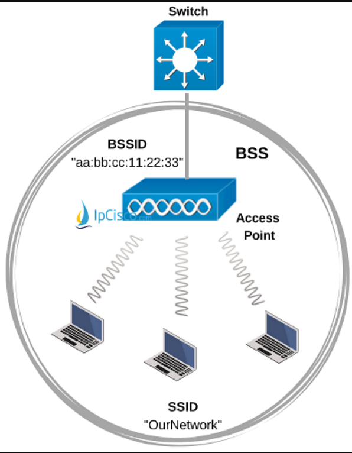
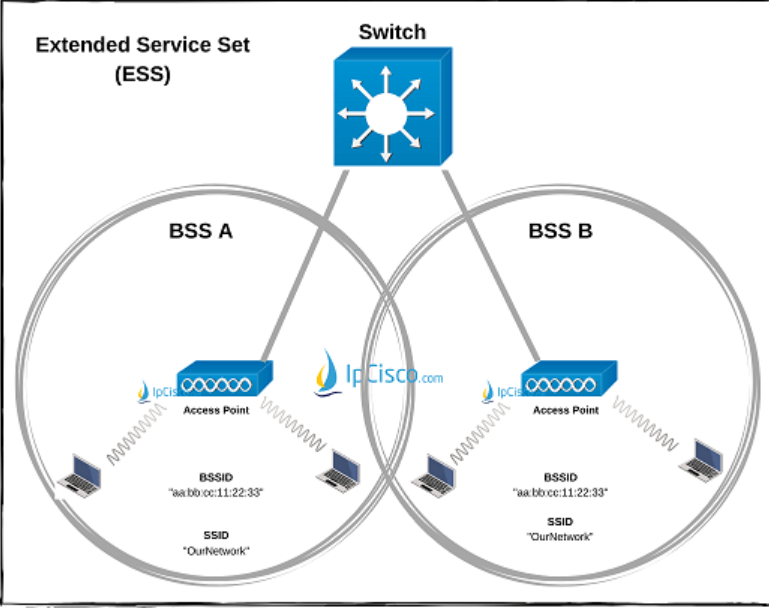
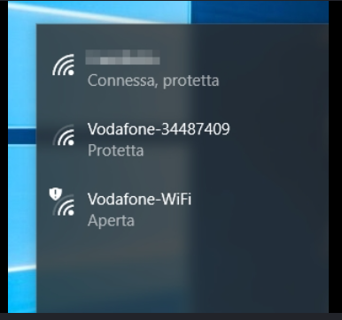
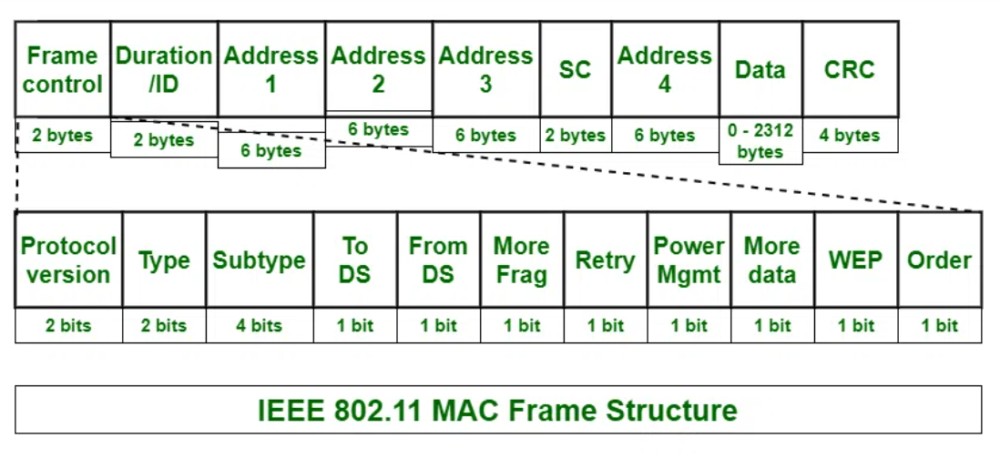
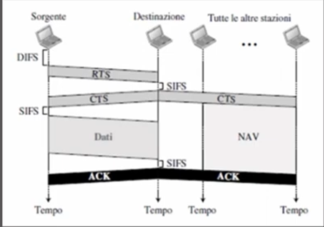

## Parte 1: Livello Fisico e Topologie

### 1. Dispositivi e Modalità

- **Access Point (AP):** Dispositivo che funge da "ponte", consentendo la connessione di stazioni/terminali wireless tramite onde radio.
- **DS (Distribution System):** Il sistema "spina dorsale" (solitamente cablato via Ethernet) che interconnette più Access Point. Permette a un dispositivo wireless di comunicare con dispositivi cablati e viceversa.
    - *Nota:* L'AP converte il **Frame Wireless** (802.11) in **Frame Ethernet** (802.3) rimuovendo gli header specifici del Wi-Fi.

### 2. Tipi di Reti Wireless

Esistono due modalità principali di organizzazione della rete:

**A. Wireless Ad-Hoc (IBSS - Independent Basic Service Set)**

- Rete **Peer-to-Peer** (P2P).
- Ogni nodo funge sia da Client che da Server.
- Struttura poco solida, non scalabile.

**B. Wireless Infrastructure (BSS - Basic Service Set) → Più usata**

- C'è un punto di coordinamento centrale: l'**Access Point (AP)**.
- Tutte le comunicazioni passano attraverso l'AP, anche se due PC sono vicini.

### 3. Identificativi e Scalabilità

- **BSS (Basic Service Set):** Un singolo AP + i dispositivi connessi.
    - **BSSID:** È l'indirizzo **MAC** fisico dell'Access Point (es. `aa:bb:cc:dd:ee:ff`).
- **ESS (Extended Service Set):** Insieme di più BSS interconnessi (più AP collegati allo stesso DS).
    - **SSID:** È il **nome logico** della rete (es. "WiFi_Casa") che identifica l'intera ESS.

BSS → BSSID (MAC address AP)

ESS → (E)SSID (Nome wifi)

SSID

> **Nota**
>
> **Perché avere più AP (ESS)?**
> 
> 1. **Copertura:** Gli AP hanno un range limitato; aggiungerne altri estende il segnale.
> 2. **Posizionamento:** Solitamente si montano sul soffitto per ridurre gli ostacoli fisici.

### 4. Gestione Avanzata

- **WLC (Wireless LAN Controller):** In reti enterprise con decine di AP, si usano **Lightweight AP** (AP "leggeri" senza cervello) gestiti centralmente dal WLC, che invia le configurazioni a tutti simultaneamente.
- **Roaming:** La capacità di un client di spostarsi da un AP all'altro senza perdere la connessione.
    - Avviene tramite **Disassociation** (dal vecchio BSS) e **Reassociation** (al nuovo BSS) in modo automatico.

## Parte 2: Livello Logico (Il Frame 802.11)

A differenza di Ethernet, il frame Wi-Fi è molto più complesso perché deve gestire un mezzo condiviso e inaffidabile (l'aria).

### Anatomia del Frame (Generic Header)

Il campo più importante è il **Frame Control** (2 Byte), diviso in sottocampi:

- **Version:** Indica lo standard IEEE usato (es. 802.11a/b/g/n/ac/ax).
- **Type & Subtype:** Definiscono la funzione del pacchetto.
    - `00` **Management:** Gestione della connessione (Associazione, Autenticazione).
    - `01` **Control:** Supporto alla trasmissione (usati nel CSMA/CA).
        - `1011` **RTS** (Request to Send)
        - `1100` **CTS** (Clear to Send)
        - `1101` **ACK** (Acknowledgment)
    - `02` **Data:** Trasporta il payload effettivo (i dati dell'utente).
- **To DS / From DS:** (Vedi tabella sotto per dettaglio).
- **More Fragments:** `1` se il pacchetto è frammentato e ne arrivano altri.
- **Retry:** `1` se è una ritrasmissione (il frame precedente non ha ricevuto ACK).
- **Power Management:** Indica se il mittente sta entrando in modalità risparmio energetico dopo l'invio.
- **More Data:** Indica al ricevente (in risparmio energetico) che ci sono altri dati bufferizzati per lui.
- **Protected Frame:** `1` se il payload è criptato (WEP/WPA2/WPA3 = Wi-Fi Protected Access).
- **Order:** (Reserved) Per trasmissione ordinata rigorosa (raro).

#### Altri campi importanti

- **Duration / ID:** Indica per quanto tempo il canale resterà occupato.
    - Serve a impostare il **NAV** (Network Allocation Vector) per il meccanismo CSMA/CA (Collision Avoidance).
- **Sequence Control:** Serve a riordinare i pacchetti.
    - *Fragment Number:* Se il pacchetto è frammentato (MTU = Maximum Trasmission Unit).
    - *Sequence Number:* Numero progressivo per identificare duplicati o pacchetti persi.

#### La Logica "To DS / From DS"

Questi due bit dicono al dispositivo la direzione del traffico e come interpretare gli indirizzi MAC (che nel Wi-Fi possono essere fino a 4!).

| **To DS** | **From DS** | **Significato** | **Descrizione** |
| --- | --- | --- | --- |
| **0** | **0** | **Host ↔ Host** | Rete Ad-Hoc (IBSS) o comunicazione diretta. |
| **0** | **1** | **AP → Host** | Download: Il frame arriva dal sistema cablato (DS) verso il client. |
| **1** | **0** | **Host → AP** | Upload: Il client invia dati verso la rete cablata (DS). |
| **1** | **1** | **AP ↔ AP** | Bridge Wireless (WDS): Mesh network o ripetitori. |

Spiegazione pratica del routing dei frame e dei 4 indirizzi MAC:

[Youtube Link - 802.11 Frames & Addressing](https://www.youtube.com/watch?v=2qeWBL5Lq54&list=PLod5uVuFMqhaEu_Qn9MmUbT6AiASm9Mja&index=14)

## CSMA/CA (Carrier Sense Multiple Access / Collision Avoidance)

### 1. Significato

> **Nota**
>
> **Differenza Chiave:**
> 
> **Ethernet (Cablato):** Usa **CSMA/CD** (Collision *Detection*). Se c'è collisione, la rileva e ritrasmette.
> 
> **Wi-Fi (Wireless):** Usa **CSMA/CA** (Collision *Avoidance*). Non può rilevare collisioni mentre trasmette (radio half-duplex), quindi deve **prevenirle** chiedendo il permesso prima.

- **CS (Carrier Sense):** "Ascolto il canale".
    - *Fisico:* Rilevo energia RF nell'aria.
    - *Virtuale:* Controllo il timer NAV (vedi sotto).
- **MA (Multiple Access):** Più dispositivi condividono lo stesso mezzo (l'aria).
- **CA (Collision Avoidance):** Algoritmo per evitare che due dispositivi parlino sopra l'altro

### 2. Instanti temporali e frame di controllo

- **SIFS (Short Inter-Frame Space):**
    - Usato per frame ad alta priorità (ACK, CTS) o per passare dalla modalità ricezione a trasmissione.
- **DIFS (Distributed Inter-Frame Space):**
    - Tempo standard di attesa prima di iniziare una *nuova* trasmissione. (DIFS > SIFS).
- **Controlli RTS Request To Send, CTS Clear to Send, ACK Acknowledge**
    - Hanno campo duration, settano NAV
- **NAV (Network Allocation Vector):**
    - È un **Carrier Sense Virtuale**.
    - È un contatore interno impostato dai frame (RTS/CTS) che dice: *"La linea sarà occupata per X millisecondi, non provare nemmeno ad ascoltare l'aria, aspetta e basta"*.

### 3. Funzionamento (Handshake)

> **Nota**
>
> **Handshake** → Processo dove due dispositivi stabiliscono una comunicazione

1. **Ascolto Iniziale:** La Sorgente vuole trasmettere.
    - Controlla il **NAV**. Se > 0, aspetta.
    - Se NAV = 0, ascolta il canale fisico per un tempo pari a **DIFS**.
2. **Backoff Casuale:** (Passaggio fondamentale anti-collisione)
    - Anche se il canale è libero dopo il DIFS, A aspetta un ulteriore tempo *random* (Backoff) per evitare di partire insieme a qualcun altro.
3. **RTS (Request To Send):**
    - A invia il frame RTS al destinatario.
    - Contiene la **Duration** (quanto tempo servirà per tutto lo scambio).
    - *Effetto:* Tutti i vicini di A leggono la duration e settano il loro NAV (zitti tutti).
4. **CTS (Clear To Send):**
    - B aspetta un **SIFS**.
    - B invia il frame CTS a A (e a tutti i suoi vicini, es. C).
    - *Effetto:* **C riceve il CTS**, capisce che B sta per ricevere dati e imposta il suo NAV (risoluzione nodo nascosto).
5. **Dati:**
    - A aspetta un **SIFS** e invia il pacchetto **DATA**.
6. **ACK:**
    - B riceve correttamente, aspetta un **SIFS** e manda **ACK**.
    - Fine trasmissione. Il NAV di tutti scade e la gara per il canale ricomincia.

### 4. Meccanismo troppo prudente?

#### Hidden terminal (PRO)

**Scenario:** `A 📡 --- 📡 B 📡 --- 📡 C`

- **A** vede **B**.
- **C** vede **B**.
- ma **A** e **C** **NON** si vedono (sono troppo lontani o c'è un ostacolo).

**Soluzione:** B usa RTS/CTS, quindi i messaggi di A vengono propagati

#### Nodo esposto (Limitazione)

**Scenario:** `A --- B --- C --- D`

- A vuole parlare con B e C con D
- **Problema:** C voleva parlare con D (che è libero!), ma è bloccato dal CTS di B.
    - Spreco di banda per evitare collisione
    - Filosofia "Better safe than sorry”
