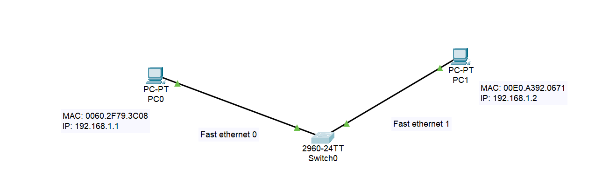
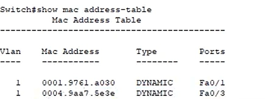
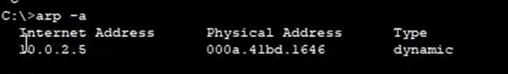

> **Nota**
>
> **Concetto Chiave:** 
> 
> **Hub:** Dispositivo di Livello 1 (Fisico) → Stupido (Ripetitore).
> **Switch:** Dispositivo di Livello 2 (Data-Link) → Intelligente (Usa i MAC Address).

## **1. Hub vs Switch**

### **Hub (Obsoleto)**

- **Funzione:** È un semplice **ripetitore multiporta**. Rigenera il segnale elettrico e lo invia a **tutte** le porte, tranne quella da cui è arrivato.
- **Logica:** Non ha memoria, non ha una MAC Address Table.
- **Duplex:** Opera in **Half-Duplex** (o trasmette o riceve, non entrambi contemporaneamente).
- **Problema:** Genera alto traffico inutile e collisioni (tutti ricevono tutto, anche se non destinato a loro).

### **Switch (Standard Attuale)**

- **Funzione:** Invia i frame solo alla porta dove si trova il destinatario specifico.
- **Logica:** "Impara" quale dispositivo è collegato a quale porta e lo memorizza nella **MAC Address Table**.
- **Duplex:** Opera in **Full-Duplex** (invia e riceve contemporaneamente).
- **Comando:** Per vedere la tabella su apparati Cisco: `show mac address-table`.

Supponiamo un ping tra questi due terminali su uno switch

Facendo un enable sull’interfaccia, posso vedere la Mac address Table dello switch, quindi le corrispondenze tra MAC address e porte fisiche (Ethernet)

### **MAC Address Table (Learning & Flooding)**

1. **Iniziale (Tabella vuota):** Lo switch riceve un frame. Non sa dove sia il destinatario, quindi lo manda a tutti (**Flooding**), comportandosi momentaneamente come un Hub.
2. **Apprendimento:** Guarda il **MAC Sorgente** del pacchetto in arrivo e si segna: *"Il dispositivo X è sulla porta 1"*.
3. **A regime:** Una volta compilata la tabella, invia i pacchetti solo alla porta specifica del destinatario (**Forwarding**).

## **2. Tipologie di Indirizzamento L2**

Lo switch (e la scheda di rete) distingue il tipo di comunicazione leggendo il **LSB (Least Significant Bit)** del primo ottetto del MAC Address.

| Tipo | Destinatario | MAC Address | Esempio |
| --- | --- | --- | --- |
| **Unicast** | 1 a 1 | **LSB = 0** | A parla solo con B. |
| **Multicast** | 1 a Molti | **LSB = 1** | A parla con un gruppo specifico. |
| **Broadcast** | 1 a Tutti | **Tutti F** | `FFFF.FFFF.FFFF` (Tutti ascoltano). |

**Approfondimento  (Switch & MAC Table):**

[Youtube Link - Switch Logic & Packet Tracer](https://www.youtube.com/watch?v=Tpv5zqBXEkw&list=PLod5uVuFMqhaEu_Qn9MmUbT6AiASm9Mja&index=16)

## **3. ARP (Address Resolution Protocol)**

> **Nota**
>
> **A cosa serve?**
> 
> Noi usiamo indirizzi **IP (Livello 3)** per comunicare (es. Ping 192.168.1.5), ma gli switch e le schede di rete capiscono solo **MAC Address (Livello 2)**.
> **ARP** è il traduttore: converte un IP noto in un MAC Address sconosciuto.

### **Funzionamento (Request & Reply)**

Immagina di voler fare un Ping verso un IP, ma la tua **ARP Cache** è vuota.

1. **ARP Request (Chi è 192.168.1.5?):**
    - Il mittente non conosce il MAC del destinatario.
    - Invia un pacchetto a indirizzo **Broadcast** (`FFFF.FFFF.FFFF`).
    - Tutti ricevono la domanda.
2. **ARP Reply (Sono io!):**
    - Gli host che non hanno quell'IP ignorano il pacchetto.
    - L'host che possiede l'IP risponde in **Unicast** (diretto al richiedente) comunicando il proprio MAC Address.
3. **Caching:**
    - Il mittente salva la coppia IP-MAC nella sua **ARP Cache Table** per non dover chiedere di nuovo in futuro.

comando arp -a

### **Comandi e Sicurezza**

- `arp -a`: Visualizza la tabella ARP corrente (Windows/Linux/Cisco).
- `sudo arp -s`: Aggiunge una voce statica manuale (utile per sicurezza).
- **Vulnerabilità: (ARP Spoofing/Poisoning):** Un attaccante può inviare risposte ARP false, dicendo "L'IP del Router corrisponde al MIO MAC address", intercettando tutto il traffico (Man In The Middle).

**Approfondimento (ARP):**

[Youtube Link - ARP Protocol Explanation](https://www.youtube.com/watch?v=C-_B4dEvdr4&list=PLod5uVuFMqhaEu_Qn9MmUbT6AiASm9Mja&index=17)
