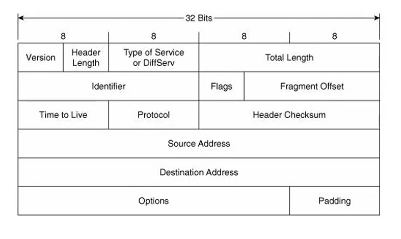
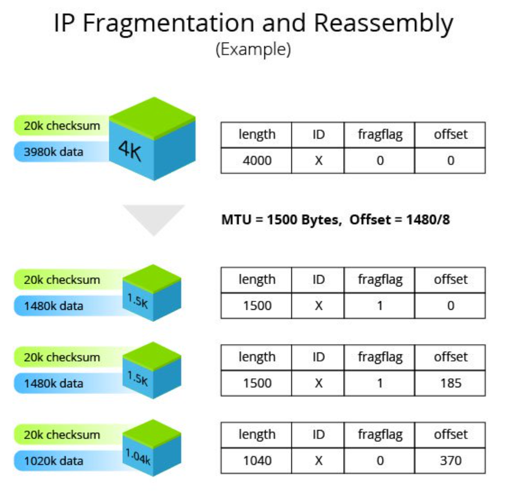
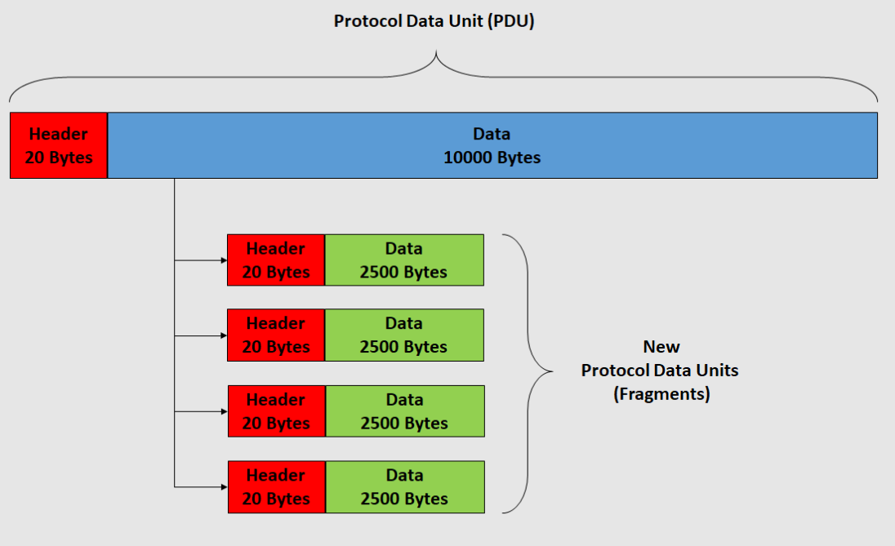
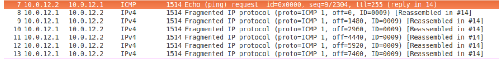
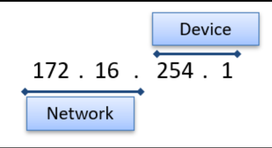
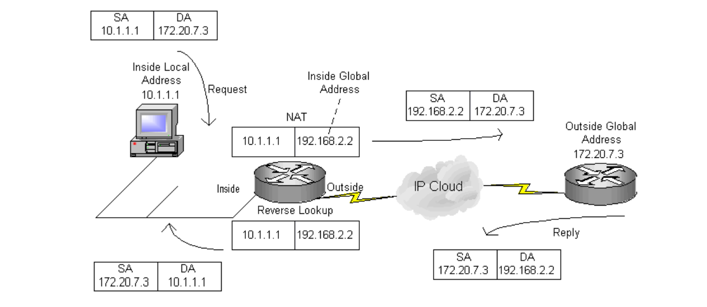
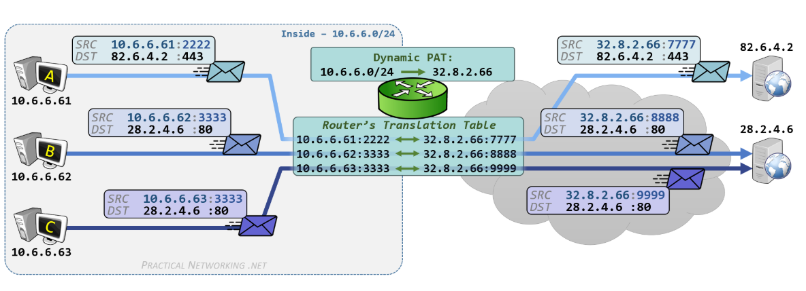

> **Nota**
>
> Siamo nel **Network Layer (L3)**.
> 
> Mentre il MAC Address (L2) serve per spostarsi all'interno di una LAN (Switch), l'**Indirizzo IP (L3)** serve per identificare univocamente un host su scala globale e permettere il **Routing** tra reti diverse (tramite Router).

## 1. Anatomia del Pacchetto IPv4

Possiede Header e payload 20-65535 byte

- Il pacchetto IP è composto da **Header** (intestazione) + **Payload** (dati).
- Dimensione Totale: Min 20 byte (solo header) - Max 65.535 byte.

### Campi dell'Header

| **Campo** | **Bit** | **Descrizione** |
| --- | --- | --- |
| **Version** | 4 | Indica la versione IP (solitamente 4, ovvero `0100`). |
| **IHL (Header Length)** | 4 | Lunghezza dell'header. Conta le "parole" da 32 bit. Minimo 5 (5*4=20 byte). |
| **ToS (Type of Service)** | 8 | Indica la priorità del pacchetto (es. QoS per VoIP o Streaming). Oggi chiamato DSCP. |
| **Total Length** | 16 | Dimensione totale del pacchetto (Header + Payload). |
| **Identification** | 16 | ID univoco per riassemblare i frammenti (vedi Frammentazione). |
| **Flags** | 3 | Bit di controllo per la frammentazione (DF, MF). |
| **Fragment Offset** | 13 | Posizione del frammento corrente rispetto al pacchetto originale. |
| **TTL (Time To Live)** | 8 | "Vita" del pacchetto. Ad ogni salto (hop) tra router viene decrementato di 1. Se arriva a 0, il pacchetto viene scartato e il router invia un ICMP "Time Exceeded". Serve a evitare loop infiniti. |
| **Protocol** | 8 | Indica quale protocollo di Livello 4 è incapsulato nel payload. |
| **Header Checksum** | 16 | Controllo integrità **solo dell'header IP**. Non controlla i dati (se ne occupa TCP/UDP). |
| **Source / Dest IP** | 32 | Indirizzo IP del mittente e del destinatario. |
| **Options** | Var | (Opzionale) Informazioni aggiuntive di routing/sicurezza (raramente usato oggi). |

### Protocol Numbers:

[Registro IANA dei numeri di protocollo](https://www.iana.org/assignments/protocol-numbers/protocol-numbers.xhtml)

Mi permette di vedere che protocollo mi ha generato i dati che vengono incapsulati dall’header: 

Per esempio:

- `1` = **ICMP** (Ping, Errori)
- `6` = **TCP** (Transmission Control Protocol)
- `17` = **UDP** (User Datagram Protocol)

## 2. Frammentazione IPv4

Quando un pacchetto supera l'**MTU** (Maximum Transmission Unit, solitamente **1500 byte** su Ethernet), il Router deve spezzarlo in frammenti più piccoli (A meno di jumbo)

Ogni frammento avrà il **suo header IP** (quasi identico all'originale) con modifiche a questi 3 campi:

### a. Identifier (16 bit)

Un numero casuale (ID) che viene copiato uguale in tutti i frammenti dello stesso pacchetto originale. Serve al destinatario per capire quali pezzi vanno insieme.

### b. Flags (3 bit)

1. **Bit 0:** Reserved (sempre 0).
2. **Bit 1 (DF - Don't Fragment):** Se settato a 1, dice "Vietato frammentare". Se il pacchetto è troppo grande e DF=1, il router lo scarta e manda errore ICMP.
3. **Bit 2 (MF - More Fragments):**
    - `1` = "Ce ne sono altri dopo di me".
    - `0` = "Io sono l'ultimo pezzo".

### c. Fragment Offset (13 bit)

Indica **dove** posizionare il payload di questo frammento nel buffer di ricostruzione.

**Regola dell'8:** L'unità di misura dell'offset sono blocchi da **8 byte**.

- *Esempio:* Se il primo frammento porta 1480 byte di dati.
- Il secondo frammento avrà Offset = 1480 / 8 = **185**.
- Chi riceve moltiplica per 8 per trovare la posizione in byte.

Sniffing del pacchetto frammentato su Wireshark

**Approfondimento Wireshark & Frammentazione:**

[Youtube Link - IPv4 Fragmentation Analysis](https://www.youtube.com/watch?v=CU3Qm5-i7ho&list=PLod5uVuFMqhaEu_Qn9MmUbT6AiASm9Mja&index=19)

## 3. Indirizzamento e CIDR

### Struttura IPv4

- **Dimensione:** 32 bit (4 Byte).
- **Spazio indirizzi:** $2^{32} \approx 4.3$ miliardi di indirizzi. (Esauriti → Soluzioni: NAT/PAT e IPv6).

**Rappresentazioni:**

- **Decimale puntata:** `192.168.1.1` (Standard umano).
- **Binaria:** `11000000.10101000.00000001.00000001`.
    - `x.x.x.x` ogni x si chiama ottetto binario
- **Esadecimale:** `0xC0.A8.01.01` (Spesso usata nei log di sistema o errori).

### CIDR (Classless Inter-Domain Routing) e Subnet Mask

esempio con CIDR /16

> **Nota**
>
> **Concetto Fondamentale:** 
> 
> **La Subnet Mask è il CIDR "sotto mentite spoglie".**
> 
> Dire `**/24**` oppure dire **`255.255.255.0`** è esattamente la stessa cosa.
> 
> - **CIDR (`/n`):** Dice quanti bit sono impostati a **1** (ON) partendo da sinistra.
> - **Subnet Mask:** È la traduzione in decimale di quei bit.
> - **Wildcard**: complementare della subnet Mask (per router CISCO)
>     - **`255.255.255.0` -> `0.0.0.255`**

È il metodo standard per dividere l'indirizzo IP in due parti: **Rete** (Network) e **Host**.

Si indica con la notazione **slash** `/n`.

**Formula:** `Indirizzo IP / CIDR (in bit)`

**Esempio:** `192.168.13.2 /24`

- **/24** significa che i primi **24 bit** sono fissi (Network Prefix).
- I restanti **8 bit** $(32 - 24 = 8)$ sono per gli Host (Suffix).

| **Parte** | **Valore** | **Descrizione** |
| --- | --- | --- |
| **Network (Prefix)** | `192.168.13` | Identifica la sottorete. Tutti gli host qui hanno questo inizio uguale. |
| **Host (Suffix)** | `.2` | Identifica il dispositivo specifico. |

### Indirizzi Riservati (Non assegnabili agli host)

In ogni subnet `/n`, due indirizzi non si possono usare per i PC:

1. **Network Address (Tutti i bit host a 0):** Identifica la rete stessa (es. `192.168.13.0`).
2. **Broadcast Address (Tutti i bit host a 1):** Indirizzo per parlare con *tutti* nella subnet (es. `192.168.13.255`).

### Default gateway

Il primo indirizzo IP utilizzabile, viene dato al router di riferimento (default gateway)

- Se il pacchetto deve attraversare il layer 3 (Network), allora l’host lo manda all’IP default gateway (quello del router) che poi farà il forward nella rete
- Senza default gateway → pc non sa dove mandare i pacchetti

### Esempio di calcolo

IPv4 + CIDR iniziale: `192.168.13.122/27` 

- (27 bit a sinistra fissi). Rimangono 5 bit variabili. 2^5 = 32 indirizzi codificabili
- Tolgo Network address e Broadcast address → 30 indirizzi codificabili

Converto in binario: `192.168.13.122` → `11000000.10101000.00001101.01111010`

Primi `/27` bit fissi (da sinistra) → `11000000.10101000.00001101.011.....` 

- 5 bit a destra partono da `00000` → Network address `192.168.13.96`
- 5 bit a destra finiscono a `11111` → Broadcast address `192.168.13.127`
- Default Gateway  `192.168.13.97` (Il primo disponibile)
- Dunque, indirizzi IP utilizzabili → [`192.168.13.97` , `192.168.13.126` ]

Netmask (`/27` bit fissi a 1)

`192.168.13.122/27` → `11111111.11111111.11111111.11100000` → `255.255.255.224`

Wildcard (complementare Netmask)

`11111111.11111111.11111111.11100000` → `00000000.00000000.00000000.00011111` → `0.0.0.31`

Calcolo:

[Video: calcolo di subnet, netmask e wildcard](https://www.youtube.com/watch?v=GleVTAg51xM&list=PLod5uVuFMqhaEu_Qn9MmUbT6AiASm9Mja&index=21&t=631s)

### Indirizzi Pubblici vs Privati e NAT (Network Address Translation)

Per risparmiare indirizzi IP (che sono finiti), Internet usa un sistema a due livelli.

**1. Indirizzi Privati (LAN)**

- Sono gratuiti e liberi. Chiunque può usarli a casa o in ufficio.
- **NON sono instradabili su Internet:** Se un router pubblico vede un pacchetto con questi IP, lo scarta.
- Servono solo per comunicare **dentro** la rete locale o arrivare fino al Gateway (Router).

| **Tipo** | **Range** | **Utilizzo tipico** |
| --- | --- | --- |
| **Privato (10/8)** | `10.0.0.0` - `10.255.255.255` | Grandi aziende / datacenter |
| **Privato (172.16/12)** | `172.16.0.0` - `172.31.255.255` | Università / Docker / VPN |
| **Privato (192.168/16)** | `192.168.0.0` - `192.168.255.255` | Reti domestiche |
| **Link-local** | `169.254.0.0` - `169.254.255.255` | APIPA quando il DHCP non è disponibile |
| **This network** | `0.0.0.0` - `0.255.255.255` | Indirizzi speciali e route predefinita |
| **Loopback** | `127.0.0.0` - `127.255.255.255` | Test locali sull'host |
| **Multicast** | `224.0.0.0` - `239.255.255.255` | Comunicazioni multicast |

**Indirizzi link-local:**

- Sono utilizzati da APIPA (Automatic Private IP Addressing) quando l'host non
  riesce a contattare un server DHCP.

**Indirizzi “this network”:**

- ACL (Network Access Control List)
- BGP Flow spec (Border Gateway Protocol) → regole di traffico a livello router
    - ES. `0.0.0.0 /0` blocca qualunque indirizzo IP
- nel DHCP discovery: `0.0.0.0` indica IP source sconosciuto o che non conosco ancora

**Loopback:**

Usati per test locali senza scomodare server esterni

- `127.0.0.1` → Localhost
    - Per gestire una richiesta server, serve un gestore web server
    - Es. `server apache2 start` → su macchina locale

**2. Indirizzi Pubblici (WAN)**

**IANA  (Internet Assigned Numbers Authority) → Assegna IP**

- Sono univoci in tutto il mondo (come un numero di telefono).
- Vengono assegnati (e affittati) dal Provider Internet (ISP).
- Sono gli unici visibili su Internet.

**3. Il ruolo del NAT (Network Address Translation)**

Il meccanismo che permette a un IP privato di navigare:

- Il Router sostituisce l'IP Privato del mittente con il proprio **IP Pubblico** prima di uscire su Internet.
- Tiene traccia della conversazione in una tabella (NAT Table) per sapere a quale dispositivo della LAN restituire la risposta.

#### NAT/PAT (Port Address Translation) -Meccanismo più efficiente

La differenza con il NAT/PORT è che si utilizzano gli stessi IP con porte  diverse

> **Nota**
>
> **A cosa serve?**
> Mentre il NAT base associa 1 IP privato a 1 IP pubblico, il **PAT (o NAT Overload)** permette a *migliaia* di dispositivi interni di navigare usando **un solo IP Pubblico**.
> Come fa? Usa le **Porte (Livello 4)** per distinguere le varie conversazioni.

### L'Esempio Pratico (Navigazione Web)

Immaginiamo che il tuo PC voglia visualizzare una pagina web.

- **IP Router (Pubblico):** `82.10.20.30`

#### 1. REQUEST (Dal PC al Router)

Il PC genera il pacchetto originale nella LAN.

- **IP SRC (Sorgente):** `10.0.0.4` (IP Privato del tuo PC).
- **PORT SRC:** `13334` (Porta effimera/randomica **scelta dal Sistema Operativo**).
- **IP DST (Destinazione):** `128.119.40.186` (IP Pubblico del Web Server, ottenuto tramite risoluzione DNS).
- **PORT DST:** `80` (Porta *Well-Known* per il protocollo HTTP).

#### 2. TRANSLATION (Il Router modifica il pacchetto)

Il Router riceve il pacchetto, si rende conto che deve uscire su Internet, quindi esegue la traduzione (NAT-PAT) prima di spedirlo al Server Web.

- **Nuovo IP SRC:** `82.10.20.30` (IP Pubblico del Router).
- **Nuova PORT SRC:** `5001` (Il Router assegna una nuova porta univoca per tracciare questa specifica connessione).
- *IP e PORT DST rimangono invariati.*

Il Router registra questa modifica nella sua **NAT Table**:

| Inside Local (LAN) | Inside Global (WAN) | Outside Global (Server) |
| --- | --- | --- |
| `10.0.0.4:13334`    | `82.10.20.30:5001`      | `128.119.40.186:80` |

#### 3. RESPOND (Dal Web Server al Router)

Il Web Server elabora la richiesta e risponde. Non conosce il tuo IP privato, quindi risponde all'IP pubblico del Router.

- **IP SRC:** `128.119.40.186`
- **PORT SRC:** `80`
- **IP DST:** `82.10.20.30` (Il tuo Router).
- **PORT DST:** `5001` (La porta che il Router aveva aperto prima).

#### 4. REVERSE TRANSLATION (Dal Router al PC)

Il Router riceve il pacchetto. Legge la porta di destinazione (`5001`), consulta la **NAT Table** e capisce che quel pacchetto era in realtà per il tuo PC.
Riscrive gli indirizzi di destinazione:

- **Nuovo IP DST:** `10.0.0.4`
- **Nuova PORT DST:** `13334`

Il pacchetto viene infine consegnato al tuo PC, che non si è mai accorto di essere stato "tradotto".

Esempio di una NAT-PAT che sfrutta le porte date dal SO
