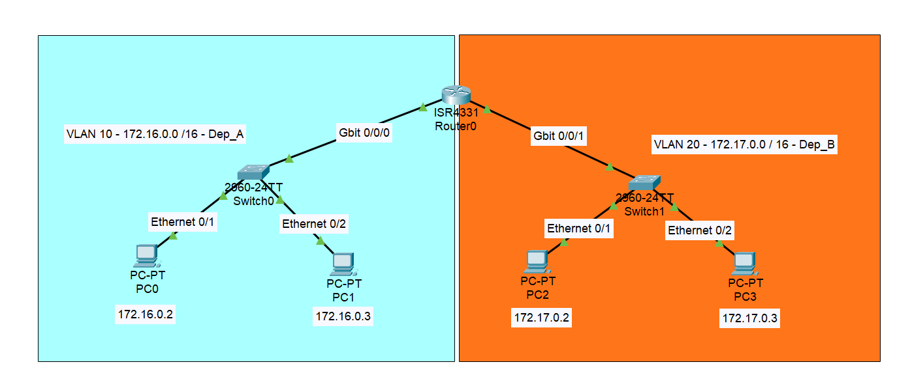
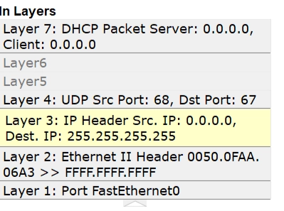
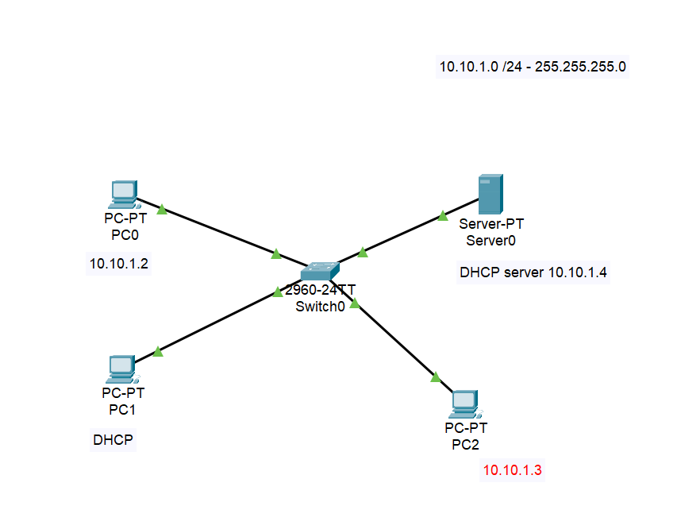
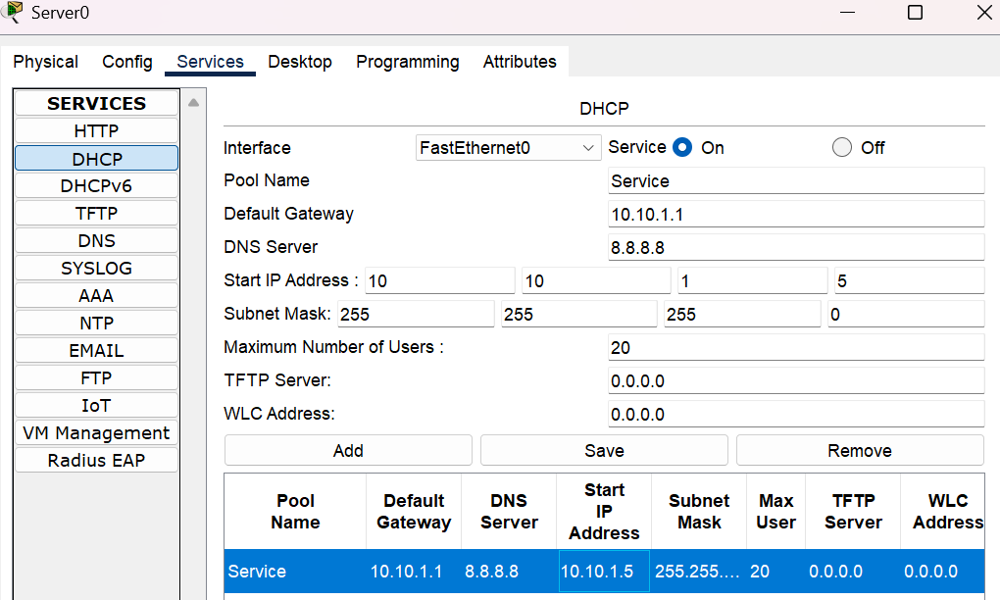
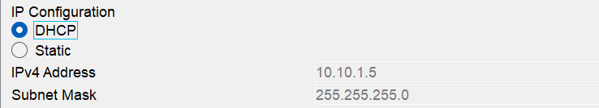

## VLAN (Virtual Local Area Network)

> **Nota**
>
> Permette di dividere logicamente un singolo Switch fisico in $n$ Switch virtuali.
> L'obiettivo principale è **frazionare il broadcast domain**, cioè il raggio
> d'azione dei pacchetti broadcast, a livello 2 (Data-Link).

La separazione del traffico in VLAN diverse porta enormi vantaggi:

- **Isolamento:** I PC della VLAN "Amministrazione" non vedono il traffico della VLAN "Ospiti".
- **Sicurezza avanzata:** Essendo reti separate, per passare da una VLAN all'altra il traffico è costretto a salire al Livello 3. Questo permette di instradarlo attraverso:
    - **Firewall / WAF**
    - **Sonde IDS/IPS** (Intrusion Detection/Prevention System)
    - **Router con ACL** (Access Control Lists) per decidere chi può accedere a cosa.
- **Organizzazione:** Raggruppo gli utenti per funzione logica, indipendentemente dalla loro scrivania fisica.

### Inter-VLAN Routing e Limiti Fisici

- Le VLAN vivono al Livello 2 (Switch). **Non comunicano tra loro di default.**
- Per far parlare la VLAN 10 con la VLAN 20 serve un dispositivo di Livello 3 (un **Router** o uno Switch L3). Questo processo si chiama *Inter-VLAN Routing* (es. configurazione *Router-on-a-stick*).
- **Attenzione all'hardware:** Anche se la VLAN è virtuale/software, sei comunque limitato dall'infrastruttura fisica (quante porte ha lo switch? quanti cavi arrivano ai vari uffici?).

Come crearle con CISCO packet tracer:

[Video: creare VLAN con Cisco Packet Tracer](https://www.youtube.com/watch?v=TaYRsPgvIg0)

## DHCP (Dynamic Host Configuration Protocol)

> **Nota**
>
> Assegna automaticamente indirizzi IP, Subnet Mask, Default Gateway e Server DNS agli host che si collegano alla rete.
> 
> N.B. Nelle reti domestiche, il ruolo di **DHCP Server** è svolto dal Router/Default Gateway.

### Come un PC ottiene un IP “automaticamente”

Quando un PC viene acceso o collegato al cavo, esegue un "balletto" di 4 pacchetti con il server, noto come processo **D.O.R.A.**:

1. **D - DISCOVER (Client ➔ Tutti):**
    
    
    
    - Il PC non ha un IP (Source: `0.0.0.0` - *"This host"*).
    - Non sa chi sia il server, quindi urla in Broadcast (Destinazione: `255.255.255.255`).
    - *"C'è un server DHCP in ascolto che può darmi un IP?"*
2. **O - OFFER (Server ➔ Client):**
    - I Server DHCP ricevono la richiesta e propongono un IP libero dal loro pool.
    - Il pacchetto è mandato spesso in Broadcast (perché il PC non ha ancora formalmente l'IP per ricevere unicast).
3. **R - REQUEST (Client ➔ Tutti):**
    - Il PC riceve l'offerta, l'accetta e manda una Request formale (sempre in Broadcast).
    - *Perché in broadcast?* Perché se ci sono più server DHCP sulla rete, questa richiesta avvisa tutti: *"Ho accettato l'offerta del Server X, voi altri potete rimettere i vostri IP nel pool"*.
4. **A - ACKNOWLEDGE (Server ➔ Client):**
    - Il Server conferma l'assegnazione finale (ACK).
    - Se l'IP non è più disponibile nel frattempo, manda un NAK (Negative Acknowledgment) e il processo riparte.

### Protocollo e Porte

- Il DHCP lavora su protocollo di trasporto **UDP L4** (veloce, non richiede connessione preventiva).
- Usa porte "Well-Known":
    - **Porta 67:** Ascolto del DHCP Server.
    - **Porta 68:** Ascolto del DHCP Client (il tuo PC).

### Gestione delle eccezioni

- **DHCP Release:** Se scolleghi correttamente il PC, manda questo messaggio per dire al server: *"Ho finito, riprenditi questo IP"*.
- **DHCP Lease Time:** L'IP non è tuo per sempre, ti viene "affittato" per un tempo prestabilito. Allo scadere, il PC deve chiederne il rinnovo.

N.B. In una rete locale domestica, chi si occupa dell’assegnazione IP (DHCP server) è il default gateway, ovvero il router.

### Configurazione su CISCO Packet tracer

1. Configuro tutti gli indirizzi statici e la subnet mask degli host (anche del server DHCP)

1. Configuro il servizio DHCP sul server 

DNS di google per semplicità

1. Eseguo la simulazione ed ottengo l’IP per il PC1

