## 1. Configuro la struttura di rete

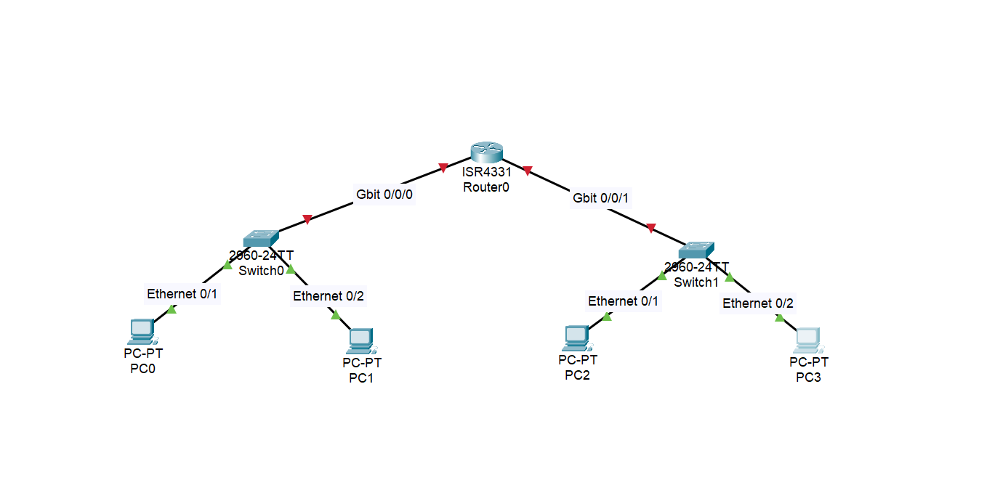

Dall’immagine, i collegamenti nelle varie porte ethernet con cavi straight-through

La struttura consisterà in:

- Due switch (uno per ciascun gruppo)
- Un router per la comunicazione tra reti locali
- Quattro postazioni, due per ciascun gruppo

## 2. Configuro indirizzi IP e netmask

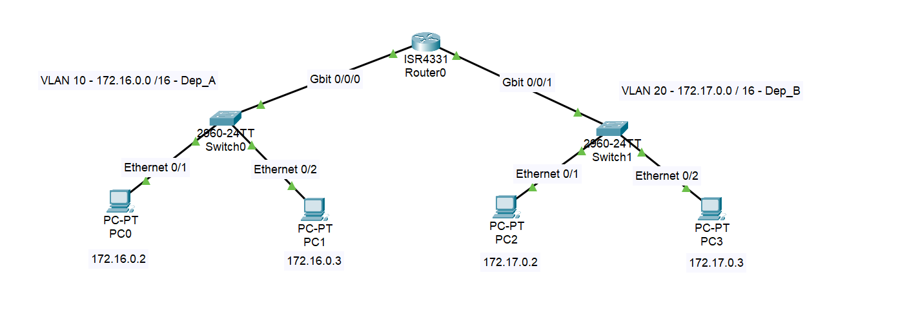

Scelgo range : `172.16.0.0` - `172.31.255.255`

- La prima VLAN 10 avrà indirizzi `172.16.0.0 /16`

**Piano di indirizzamento della VLAN 10:**

- `172.16.0.0` è il network address.
- `172.16.0.1` è utilizzato come default gateway.
- `172.16.255.255` è il broadcast address della rete `/16`.
- La seconda VLAN 20 avrà indirizzi `172.17.0.0 /16`

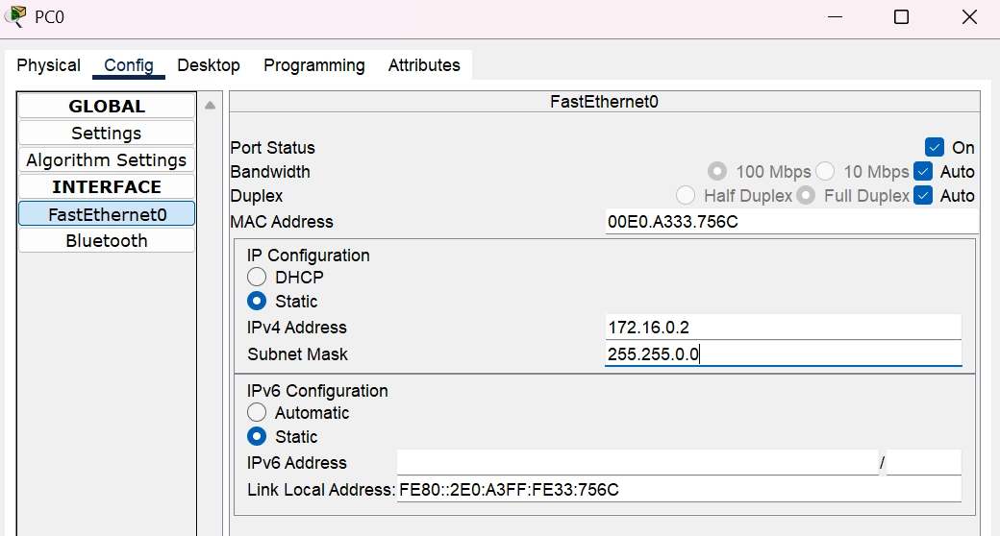

Configurazione indirizzo statico del PC-0. La subnet mask è automatica

- Se pingo l’indirizzo `172.16.0.3` da `172.16.0.2` la configurazione risulta corretta

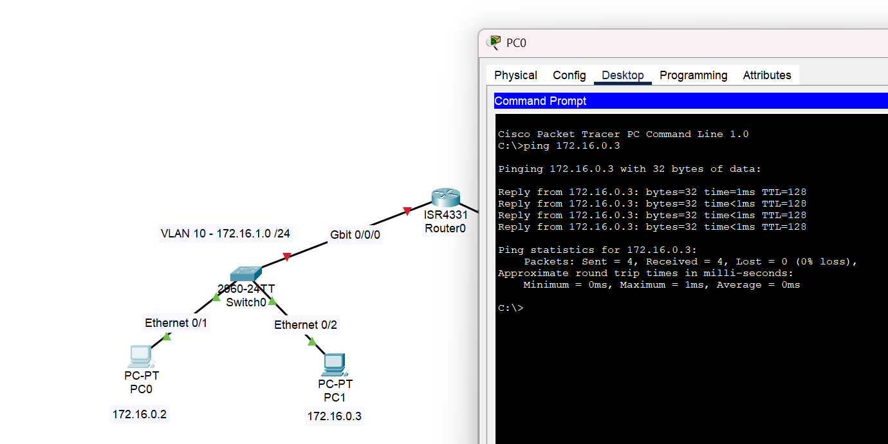

## 3. Configuro le VLAN a livello di Switch


Click sullo switch → CLI → Enter

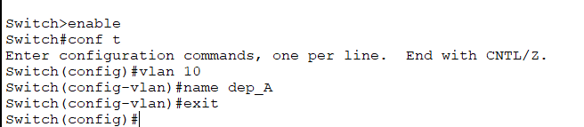

Creo una nuova VLAN con il nome dep_A

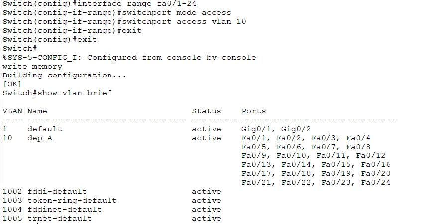

Faccio la stessa cosa per lo switch 2:

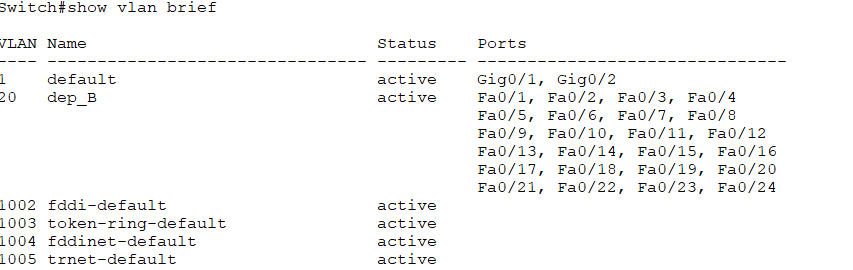

## 4. Configuro il router

- Se pingo dalla VLAN 10 alla VLAN 20, non riceverò risposta: serve configurare il router.

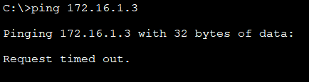

- Configuro porta router `gig0/0/0` con default gateway `172.16.0.1`  e subnet mask `255.255.0.0`

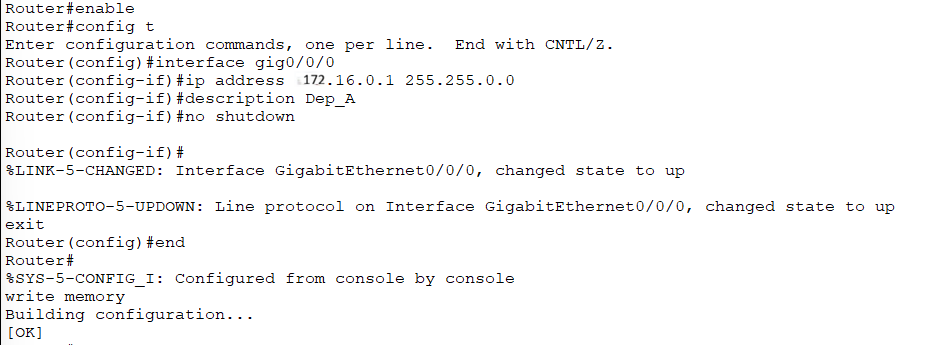

- Eseguo la stessa configurazione per la porta `gig0/0/1` con default gateway `172.17.0.1` e subnet mask `255.255.0.0`

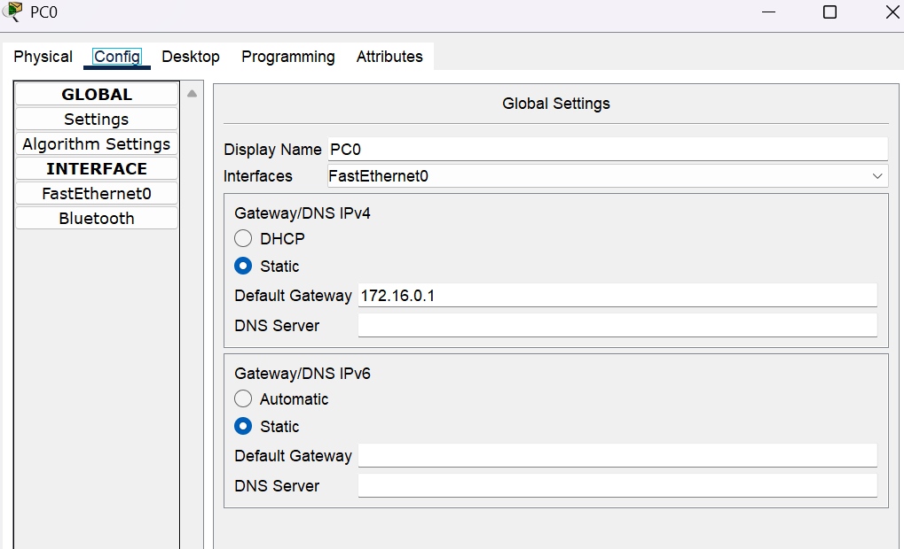

Imposto il default gateway (IP del router) su tutti e quattro i pc - ES: PC0

- A questo punto avrò ottenuto una corretta configurazione

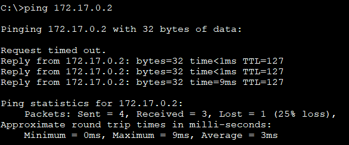

N.B. Il primo ping va in 'Request timed out' a causa del processo ARP (Address Resolution Protocol). Il PC e il router devono scambiarsi i rispettivi indirizzi MAC fisici prima di poter instradare il pacchetto IP. Una volta risolto l'indirizzo, i ping successivi vanno a buon fine.

---

**Nota a margine sulla configurazione delle porte:**
In questo laboratorio, il cavo che collega lo Switch al Router utilizza una delle 24 porte **FastEthernet** (che viaggiano a 100 Mbps). Avendo inserito l'intero range `Fa0/1 - 24` all'interno della VLAN 10 e 20, il traffico scorre perfettamente e i ping verso il Default Gateway hanno successo.

**Cosa cambia in azienda?**
In un ambiente di produzione reale, il collegamento verso il router (chiamato *Uplink*) deve smaltire il traffico di tutti i PC contemporaneamente. Per evitare "colli di bottiglia", si utilizzano le porte **GigabitEthernet** dello switch (1000 Mbps), come la `Gig0/0/0`.

Se avessimo usato la porta Gigabit per il router, avremmo dovuto esplicitamente assegnare anche quella alla nostra VLAN con questi comandi:

```bash
Switch(config)# interface gig0/0/0
Switch(config-if)# switchport mode access
Switch(config-if)# switchport access vlan 10
```

*Un piccolo dettaglio architetturale che fa la differenza quando si progettano reti ad alte prestazioni!*
