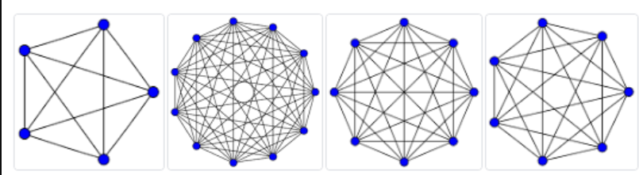
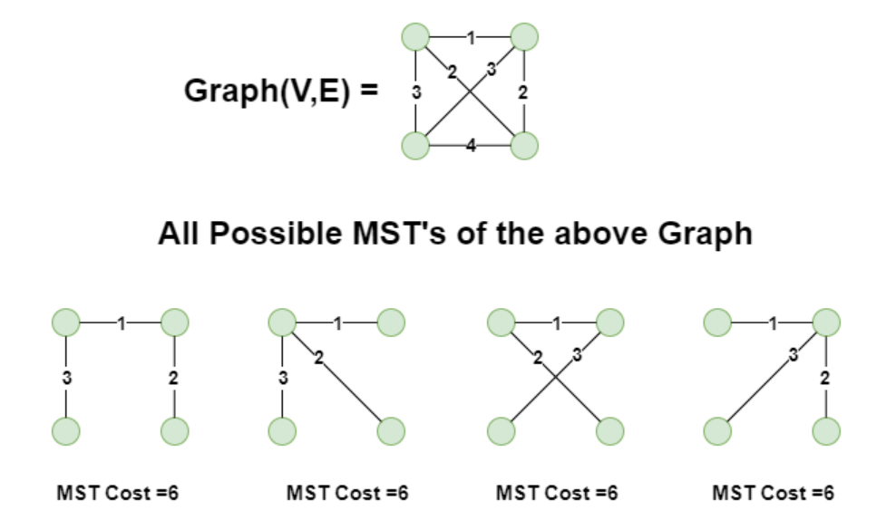
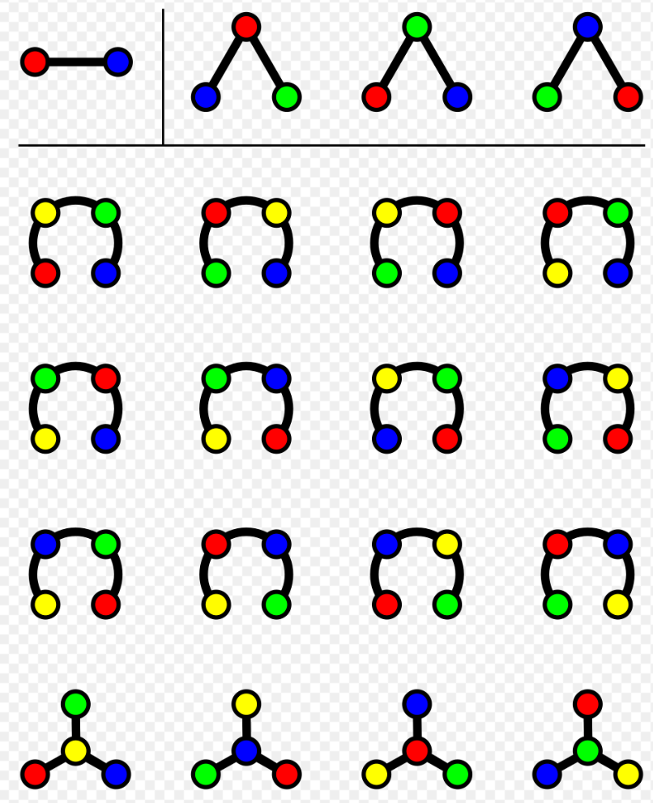
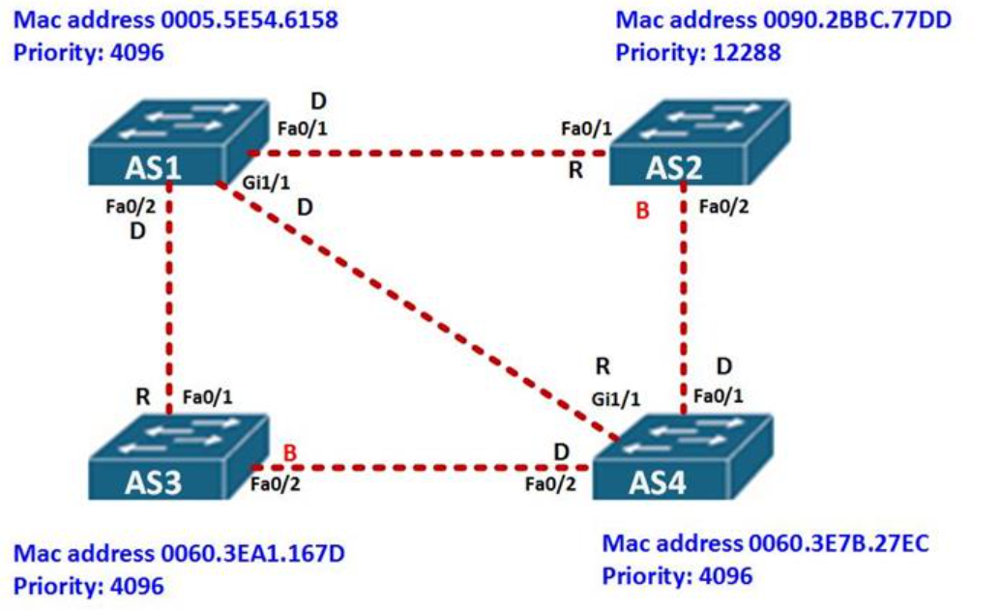
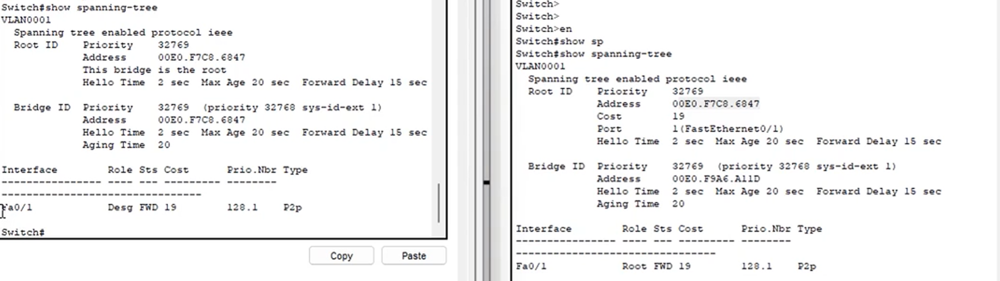

## 1. Il problema del Layer 2: Broadcast Storm

> **Nota**
>
>  **Perché serve lo STP?**
> 
> Nelle reti aziendali vogliamo **ridondanza** (più cavi e più switch per evitare che un guasto fermi tutto).
> 
> Tuttavia, gli Switch (Livello 2) non hanno un meccanismo come il TTL (Time To Live) dell'IP. Se si crea un loop fisico, i pacchetti broadcast iniziano a girare all'infinito moltiplicandosi, causando un **Broadcast Storm** che fa crashare l'intera rete in pochi secondi.

- **Il problema:** La MAC Address Table impazzisce (lo switch vede lo stesso MAC arrivare da porte diverse in continuazione) e la CPU va al 100%.
- **La soluzione:** Lo **STP (Spanning Tree Protocol)**. Un demone sempre in esecuzione che blocca logicamente i loop fisici.

Per approfondire:

[Video: introduzione allo Spanning Tree Protocol](https://www.youtube.com/watch?v=J47NyICCtuQ&list=PLod5uVuFMqhaEu_Qn9MmUbT6AiASm9Mja&index=27)

[Animazione di una broadcast storm](https://i.makeagif.com/media/2-15-2016/Ie59Cy.mp4)

## 2. Come funziona lo STP (IEEE 802.1D)

Lo STP si basa sulla teoria dei grafi: trasforma un "grafo completo" (tutti interconnessi, con loop) in uno **Spanning Tree** (grafo connesso senza loop).

**Grafo completo**: tuti nodi interconnessi tra loro con maggior numero di archi

$$
archi=\frac{n(n-1)}{2}
$$

**Spanning tree:** grafo connesso con minor numero di archi

$$
ST_{possibili}=n^{n-2}
$$

### L'algoritmo in 3 passi

Gli switch comunicano tra loro scambiandosi messaggi chiamati **BPDU (Bridge Protocol Data Unit)**.

1. **Elezione del Root Bridge (Il "Capo"):**
    - Vince lo switch con il **Bridge ID più basso**.
    - Il Bridge ID è composto da: `Priority + MAC Address`.
    - *Esempio:* Se tutti hanno la priority di default (32768), vince chi ha il **MAC Address più basso** (es. `00E0.F7C8.6847`).
2. **Calcolo del percorso migliore:**
    - Tutti gli altri switch (Non-Root) calcolano il percorso con il "Costo" minore per raggiungere il Root Bridge (il costo dipende dalla velocità del cavo, es. Gigabit costa meno di FastEthernet).
3. **Assegnazione dei ruoli alle porte:**
    - **Root Port (RP):** La porta che guarda *verso* il Root Bridge (percorso più veloce).
    - **Designated Port (DP):** La porta che allontana dal Root Bridge. *(Nota: Il Root Bridge ha SOLO Designated Ports).*
    - **Blocking Port (BLK):** La porta disattivata logicamente per spezzare il loop. Se un cavo principale si rompe, l'algoritmo dinamico la riattiva automaticamente.

Switch AS1 ha solo Designated ports per via del suo MAC address

Per approfondire:

[Video: elezione del root bridge e ruoli delle porte STP](https://www.youtube.com/watch?v=kxEmuL5tEek&list=PLod5uVuFMqhaEu_Qn9MmUbT6AiASm9Mja&index=28)

Vista di due switch: a priorità di priority `32769` viene scelto switch con MAC Address minore `00E0.F7C8.6847` 

Da notare come il ruolo delle due porte ethernet cambi: per lo switch a destra abbiamo una Fa0/1 con ruolo `Desg` , mentre per quello a sinistra un ruolo di `root`

## 3. ICMPv4 (Internet Control Message Protocol)

### A cosa serve?

- **Segnalazione Errori:** Avvisa se un router scarta un pacchetto (es. TTL scaduto, Rete non raggiungibile).
- **Query/Response:** Diagnostica di rete (il comando **Ping** e **Traceroute** si basano su ICMP).

### Anatomia dell'Header ICMP (8 Byte fissi)

| **Campo** | **Bit** | **Descrizione** |
| --- | --- | --- |
| **Type** | 8 | Categoria del messaggio: `0` Echo Reply; `3` Destination Unreachable; `8` Echo Request; `11` Time Exceeded. |
| **Code** | 8 | Specifica il motivo esatto relativo al *Type*. |
| **Checksum** | 16 | Controllo di integrità del messaggio. |
| **Data** | Var | Dati variabili (es. una copia dell'header IP del pacchetto che ha causato l'errore). |
