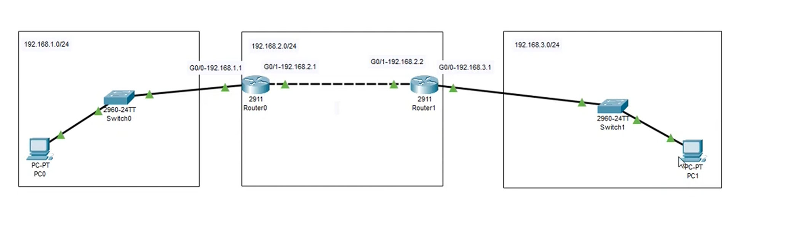
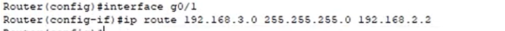
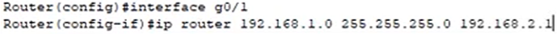
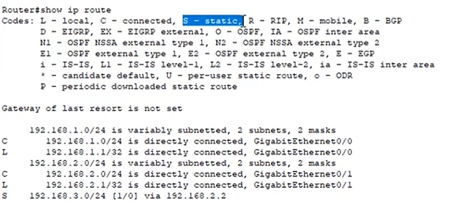

## 1. Configurazione di due WAN

1. Creo LAN e imposto indirizzi IP e submask
2. Imposto interfaccia router
3. Imposto default gateway ai pc interessati

## 2. Rotte statiche manuali

Le rotte diventano necessarie quando più router collegano LAN diverse. Esistono
anche protocolli di routing dinamico come BGP, OSPF, EIGRP e RIP.

Il segmento di rete 192.168.1.0/24 può vedere solo il default gateway che comunica con il secondo router più a destra

La rotta statica fa sì che il primo segmento di rete possa comunicare con la seconda LAN e viceversa

da 192.168.3.0 salto a 192.168.2.2

secondo salto

Posso vedere le rotte statiche con `show ip route`.

**Forwarding:** azione con cui il router inoltra un pacchetto.

**Routing:** processo con cui il router sceglie il percorso.
